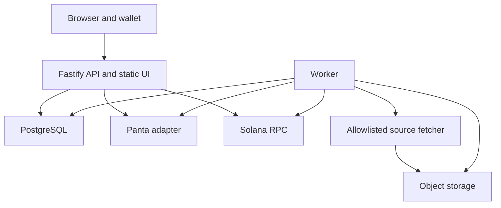

# Clerk + Resolve: gated engineering blueprint

Version 1.0 · 2 October 2026 · Intended reader: senior full-stack/Solana engineer

**Deliverable:** a normative implementation specification for Clerk’s authoring, approval, publication, participation, and evidence workflow, backed by Resolve’s deterministic compiler.

**Notation:** MUST is a release requirement. SHOULD is an explicitly nonblocking recommendation. Every identifier beginning `G` names a gate. All gates are initially **NOT RUN**. No test result or production compatibility is implied by this blueprint.

**Important boundary:** internal interfaces below are design decisions. Panta wire schemas and network identities are external facts. The Panta documentation could not be retrieved during this review. Those facts are frozen by the pre-build conformance gate, not guessed. A failed capability gate stops the dependent product; it does not authorize a mock to be presented as live integration.

## 1. Start here: falsification tests before the application

Do not start the full UI, database platform, or general-purpose compiler first. Create only `spikes/`, fixture files, a minimal wallet page, and an evidence folder. The first milestone is a verified dependency chain, including the eventual claim path.

### 1.1 Gate execution contract

Each gate produces `evidence/gates/<gate-id>.json`. Run G0.5 before the coded G0.4 transaction spike; G0.1/G0.2 read-only discovery and G0.3 product study can precede it. G0 is complete only when all subgates pass:

```json
{
  "gateId": "G0.1",
  "status": "NOT_RUN",
  "commit": null,
  "environment": "local",
  "startedAt": null,
  "finishedAt": null,
  "executor": null,
  "reviewer": null,
  "checks": [],
  "artifactPaths": [],
  "blockingFindings": [],
  "decision": "STOP"
}
```

On execution, timestamps are UTC RFC3339, commit is the full Git SHA, executor/reviewer are named humans, and each check is `{id, expected, actual, passed, evidencePath}`. `status` is `NOT_RUN|RUNNING|PASS|FAIL`. A PASS requires every required check to pass, no blocking finding, immutable artifact hashes, and a reviewer sign-off recorded in the file. The same person may execute and review in a solo team, but must disclose that fact. User-study reviewers must be independent of the team.

`pnpm gate:check G1` checks predecessor status and commit compatibility; it MUST exit nonzero on missing evidence. A change to the adapter, compiler semantics, transaction policy, or capability manifest invalidates affected downstream gates. Documentation-only changes do not invalidate behavior tests. Record this dependency in each gate’s `inputs` hash map when implementing the runner. Extend the example gate record with `inputs: Record<string,Hash>` and `artifacts: {path,sha256}[]`; these are mandatory on PASS.

### 1.2 G0.1 — prove access and freeze Panta’s actual contract

**Hypothesis:** the account can create, inspect, buy, and claim a supported binary market using a normal external wallet, without unsupported custody or resolution extensions.

Implement `spikes/panta-conformance.ts` and a static browser wallet harness. Read credentials only from local environment/secret manager. Redact authorization headers before storing evidence.

| Test | Exact action | Pass condition | Failure action |
|---|---|---|---|
| CAP-01 | Retrieve current official schemas/docs with the actual developer account; capture endpoint/method/body/response/error fixtures | Every method in §7 has a versioned runtime validator and a recorded source; no guessed required field | Stop integration; obtain sponsor clarification |
| CAP-02 | Read catalog, one market, positions for the test wallet | JSON validates; prices may be null; network/program/mint identities are known | Stop financial implementation |
| CAP-03 | Request a creation quote with the exact template in §3 | Account permission, fee denomination, all required fields, source acceptance, start delay, limits, and expiry are explicit | Stop; do not silently switch to breaking markets |
| CAP-04 | Build create transaction; resolve all lookup tables; decode instructions and account bindings | Every monetary effect is explained; publisher and fee payer match the test wallet; decoder covers every supported instruction | Stop writes if only program IDs can be checked |
| CAP-05 | Obtain sponsor confirmation of the exact source, UTC candle semantics, and missing/revised-data treatment | Dated confirmation or official specification sufficient for §3; no assumption that a URL alone is resolvable | Stop this category; any replacement needs a new spec and rerun G0 |
| CAP-06 | Confirm buy, submit/verify, positions, win-claim contracts; record creator-fee-claim availability separately | Exact supported phases, fee/amount units, win-claim prerequisites and indexing behavior captured; unavailable creator-fee claim is explicitly disabled | Stop required module; optional creator claim may remain disabled |
| CAP-07 | Confirm network via RPC genesis identity plus official Panta configuration and an observed transaction | All identities agree; key prefix is not used as evidence of a sandbox | Stop on mismatch |
| CAP-08 | Confirm invalid/cancelled/disputed/delayed-market states and publication field limits | Explicit mapping to normalized lifecycle; unknown state is mapped to UNKNOWN and blocks action | No promise of guaranteed resolution or refunds |

Output: `contracts/panta-capabilities.json`, pinned JSON Schemas, sanitized raw fixtures, and a signed-off capability matrix. Exact manifest fields are in §7. There is no downstream green gate while its required entries are null.

### 1.3 G0.2 — prove the evidence source and deterministic semantics

**Chosen first adapter:** Coinbase Exchange BTC-USD daily candles, not an arbitrary website scraper. Official documentation describes time-bucket data, warns of missing intervals, and notes that returned rows can precede the requested range [S2].

Implement only `spikes/source-conformance.ts` and `packages/compiler/evaluate.ts` with fixtures.

1. Fetch 30 completed UTC daily buckets through the fixed adapter. Require HTTP success **and** JSON content type **and** valid shape. A 200 HTML error page is failure.
2. For each requested day, select exactly its timestamp; never select the first returned row.
3. Preserve source numeric lexemes before normalizing to decimal strings. No binary floating-point price comparison.
4. Check shape, duplicate timestamps, OHLC consistency, bucket alignment, missing interval, empty body, and wrong product.
5. Repeat retrieval of five days after at least five minutes. Record changes; any change creates a revision fixture rather than being discarded.
6. Run all deterministic cases in §5.5. Every expected result must match.
7. Verify the deployed server region can reach the same source. Local access is insufficient.

**PASS:** all 30 requested days produce a valid observation or an explicitly explained source-gap record; at least 25 are valid; all golden cases pass; no missing/error case becomes NO; capture retention is permitted for the intended public packet. These sample thresholds are project decision thresholds, not a statistical guarantee of data quality.

**FAIL:** stop the source-dependent build. Do not switch to a different exchange, infer missing closes, use spot prices, or drop time semantics. Redefining the adapter requires a new template version and a rerun of G0.1/G0.2.

**Research status:** official source documentation was accessible. A direct source request in this session returned HTTP 200 with an HTML “Site Unavailable” body. It did not validate live source access. G0.2 remains NOT RUN.

### 1.4 G0.3 — falsify the product, not just the integration

**Hypothesis:** a compiler-assisted packet materially improves resolution clarity compared with an ordinary market-creation form and manual rule writing.

Recruit five independent people who create or review prediction markets. This is a task for the implementation team; no outreach has been performed here. Use 30 claims within the selected price category: ten straightforward, ten ambiguous on date/source/comparator, ten intentionally incomplete or unsupported. Freeze the test set before iterating on it. Keep an additional ten development claims separate.

Use a counterbalanced study: half the participants see baseline wording first, half see compiler-assisted wording first. Two independent reviewers evaluate every resulting packet without being told which flow produced it. They answer: source, exact observation window, equality outcome, missing-source outcome, and whether they would publish it. A third reviewer adjudicates disagreements. The expected answer key is written by humans before viewing compiler output.

Record completion time, semantic mistakes, unresolved fields, interpretation disagreements, and whether a participant wants to use it again. A blocked ambiguous draft counts as correct refusal, not a completed market.

**PASS, all required:**

- At least 3/5 participants report a specific recurring authoring/review task and agree to a second trial.
- At least 90% of supported, complete cases reach the correct specification without engineer intervention.
- Zero intentionally unsupported/missing-critical-field cases are falsely declared publishable.
- Reviewer disagreement is at least 30% lower than baseline when baseline disagreement is nonzero; if baseline has fewer than three disagreement cases, the study is inconclusive and must use more difficult real drafts.
- Median task time is no worse than baseline, or at least 3/5 participants explicitly prefer the slower flow because the extra check prevents a named error.

**FAIL:** stop the full product. Revise the workflow once against the development set and rerun on a new held-out set. A second failure means retain the integration spike as reusable infrastructure and do not claim product validation.

### 1.5 G0.4 — minimal full financial lifecycle, before platform work

This requires a documented human-approved test budget, owned wallets, and permitted account access. The blueprint itself is not authorization to spend funds. Set numeric caps in `spikes/budget.json`: total USDC, creation fee maximum, total buy spend, and SOL network-fee maximum. No secrets belong in that file. The wallet owner signs every transaction.

Using only the spike harness:

1. Anchor one approval hash with the Memo program (§8).
2. Create **one** source-compatible market; wait for actual chain finality and registration.
3. Read it back and compare all available published semantic fields with the approved payload.
4. Buy the minimum useful permitted amount; prove position ownership and attribution.
5. Complete a real eligible win claim, either in this market after resolution or in another legitimately owned winning position. A sponsor-provided supported test environment can satisfy this if its claim contract is demonstrably the same; local fabricated fixtures cannot.
6. Probe the creator-fee claim path only on an eligible owned position; if no eligibility exists, mark creator-fee UI deferred, as allowed by the scope in §2. No assumed graduation.
7. Cut network response after sending signed bytes. Restart the harness. It must discover the existing signature and never issue a second spend.
8. Simulate wrong wallet, changed instruction, stale quote, source outage, and indexing delay with labeled fixtures; document which cases were live versus simulated.

**PASS:** actual create, buy, position, and win-claim paths are evidenced; every signed message matches inspection; interruption recovery is proved; actual source/resolution behavior agrees with the supported rule or is explicitly understood. If the newly created market has not resolved, its own resolution remains a G6 release prerequisite even if another claim passes this spike.

**FAIL:** do not start G1. If no eligible claim can be obtained, wait or explicitly revise the requested release to exclude integrated claim completion. That revision is not the end-to-end release specified here. A readable position or an unsigned claim is not a completed claim.

### 1.6 G0.5 — prove a reproducible toolchain

Use Node 24 LTS line, TypeScript, React 19, Vite, Fastify 5, Zod, PostgreSQL 17, `pg`, `@solana/web3.js` v1 for the Panta legacy/v0 bridge, Wallet Standard discovery/signing, a lossless JSON parser, an RFC8785 JCS implementation, Vitest, and Playwright. These are selected compatibility families, not claims of the latest patch releases.

Resolve currently supported compatible patch versions from their official registries at implementation start, pin **exact versions** with no ranges, generate `pnpm-lock.yaml`, and record Node/pnpm/container image digests in `contracts/toolchain.json`. Check advisories and wallet compatibility before accepting the lock. The rest of the build uses `pnpm install --frozen-lockfile`. No phase may silently update versions. Add current official support/registry URLs and the date checked to the toolchain evidence; if Node 24 or a selected family is unsupported in the actual deployment, revise G0.5 before using it. Do not mix Solana SDK generations across the adapter boundary.

PASS: a clean container can parse/build/sign/simulate the captured v0 fixture, run the compiler suite, launch the two-wallet harness, and reproduce the same normalized payload hashes. Commit a license inventory. This bounded compatibility spike precedes application code.

## 2. Release scope and acceptance contract

### 2.1 User and workflow

A **publisher** is an authenticated wallet holder who owns a packet. A **reader** needs no account. A **participant** is an authenticated wallet holder buying/claiming their own positions. An **operator** is an allowlisted human wallet able to pause new writes and inspect jobs; operator status does not permit editing user approvals or moving user money.

One owner per packet; no organizations, invitations, pooled wallets, or delegation in release 1. Independent review is captured in pilot evidence, not a team-permission subsystem.

Workflow:

`claim intake → structured draft → deterministic compile/tests → human review → wallet-signed approval anchor → Panta quote/review/sign → publication receipt → optional user buy → evidence assessment → Panta outcome/claim eligibility → user-signed win claim → final packet export`.

### 2.2 Included and explicitly absent

| Included | Exact boundary |
|---|---|
| Claim intake | Text or structured form for BTC-USD UTC daily close, GT/GTE comparator |
| Compiler | One AST, deterministic renderer/evaluator, fixed source adapter, golden tests |
| AI assistant | Suggests AST fields and clarification questions; never decides admissibility/outcome or signs |
| Approval | Immutable manifest hash anchored by publisher’s signed Memo transaction |
| Publication | Panta creation using a normal wallet; durable reconciliation |
| Participation | Wallet-signed primary buy and win claim only |
| Evidence | Archived source bytes, deterministic assessment, comparison with Panta’s outcome |
| Public packet | Approved rule, source, lifecycle, integrity check, transactions, downloadable bundle |
| Creator-fee claim | Deferred unless G0.4 proves eligibility/path; not needed for release acceptance |
| Custom Solana program | **None**; no Anchor program, PDA vault, escrow, token, staking, or upgrade authority |
| Secondary trading | None; no sell, limit order, cash-out, guaranteed reimbursement |
| Arbitrary sources | None; submitted URLs are not fetched; only compiler-built source URLs |
| Disputes | Downloadable advisory memo; no automatic challenge/court or resolver replacement |
| Additional products | No Fee Forge, generalized MCP server, reputation leaderboard, or Archive indexer |

The first domain is deliberately narrow. If the pilot shows no incremental value over a structured form, G0.3 fails. Generalizing the domain is not a substitute for passing that test.

### 2.3 End-to-end done

A new non-founder wallet can create and approve a valid packet, publish it, inspect the immutable approved version, buy an eligible position, view a reproducible assessment after the observation window, and claim an eligible winning position. A lost RPC response, duplicate click, changed payload, unavailable source, or unknown Panta status never becomes a duplicate spend or fabricated success. An independent reader can verify the downloaded packet against the approval transaction without trusting Clerk’s database.

## 3. Exact first market semantics

### 3.1 Template `coinbase-btc-usd-daily-close/v1`

The proposition is: **the Coinbase Exchange BTC-USD candle close for UTC date D is strictly greater than, or greater than/equal to, threshold K USD**. It is not a global BTC price, intraday high, local-day price, or a promise about a particular instant’s ticker.

AST-controlled inputs: UTC date `D`, comparator `GT|GTE`, threshold decimal `K`. Product is fixed `BTC-USD`, candle interval fixed 86400 seconds, currency fixed USD. More products/operators require a new template release and tests.

Source URL is constructed internally:

`https://api.exchange.coinbase.com/products/BTC-USD/candles?granularity=86400&start=<D 00:00:00Z>&end=<D+1 00:00:00Z>`

Query keys are serialized in the shown order with RFC3986 percent encoding. Select the unique row whose timestamp equals the Unix seconds for D at UTC midnight. Other rows do not affect the result. The adapter checks six entries: timestamp, low, high, open, close, volume. Accept only the actual schema frozen at G0.2; the specification anticipates that documented response shape, but no blind tuple cast is allowed.

### 3.2 Time and evidence policy

Let `C` be the next UTC midnight after D. The market closes for trading at C. Desired resolution time is C + 3600 seconds. Source collection begins C + 600 seconds; scheduled captures are C+600, +1200, +1800, +2400, +3000, +3540 seconds. Each has at most two retries at +15 and +45 seconds, provided completion remains before C+3600. Cache one capture per URL/time slot across all packets. This low-frequency schedule avoids price-feed polling behavior.

At or after C+3600, Clerk produces an advisory YES/NO only if at least two valid successful captures completed before C+3600, are separated by at least 300 seconds, and **all valid captured close values agree exactly**. Otherwise output NEEDS_REVIEW. A transient failed fetch does not invalidate two agreeing valid captures; two different valid closes do. Missing interval, no valid observations, malformed data, or late-only data never becomes NO.

These are Clerk’s evidence sufficiency rules, **not a unilateral Panta settlement rule**. G0.1 must confirm whether this category and the generated resolution text are compatible with Panta. Panta remains the outcome authority. If its supported rule cannot express this evidence policy, stop and revise the template before any live creation. Do not silently publish different semantics.

Later source revisions generate a new advisory assessment with `SOURCE_REVISED`; they never rewrite a previous capture, approval, or outcome. Display the old/new values and separate Panta’s resolution from Clerk’s assessment. Retrospective captures outside the window can explain a discrepancy but cannot retroactively satisfy the original capture policy.

### 3.3 Publication timing and exact renderer

Publisher supplies a `marketStartAt` UTC time. Before anchor/quote/build, require it to be at least `now + manifest.minCreateLeadSeconds + 300`, and at least 3600 seconds before C. No breaking-market mode. `endTime=C`; `resolutionTime=C+3600`. If the start time becomes invalid, create a new plan/version, regenerate tests, and reapprove. Never silently change signed times.

Deterministic question:

`Will Coinbase Exchange BTC-USD close {above|at or above} {K} USD for {D} UTC?`

Deterministic resolution text:

`Use Coinbase Exchange BTC-USD daily candles (86400 seconds). Select the candle beginning {D}T00:00:00Z and ending {D+1}T00:00:00Z. Compare its close in USD with {K}: YES iff close {>|>=} {K}; otherwise NO. Use the exact source URL supplied. Do not substitute intraday high, ticker, another exchange, or a local-date candle. Missing, conflicting, revised, or unavailable data requires review under the platform's supported resolution process; do not infer NO. Clerk's archived evidence policy is {policyId}.`

The final text, source list, and supported policy references are checked against G0.1 acceptance and actual upstream length limits. If a policy ID alone is insufficient for the upstream resolver, its complete accepted wording must be rendered into the payload during G0.1; freeze that renderer version and rerun golden hashes. No deferred “we will explain it later.”

`title` equals question. `description` is generated from the approved semantic fields and explains the advisory/Panta distinction. `category=crypto`, `marketType=standard`, `eventInProgress=false` only if these enum values are confirmed. Image is the deterministic 1024×1024 PNG generated from product/date/threshold/comparator; it contains no AI artwork or externally fetched assets. Its content hash and permanent public URL are part of the approved plan. The bytes remain private until the publisher accepts disclosure and the approval anchor is ACTIVE; the same URL returns 404 beforehand. Public image route appears in §10.

## 4. System architecture and module ownership

### 4.1 Deployment topology

One repository; three process types from one immutable image: API, worker, and migration/gate CLI. React assets are served by the API under the same origin. PostgreSQL owns domain state, jobs, locks, and the outbox. S3-compatible object storage holds immutable captures and exports. There is no Redis requirement.



Browser signs; it never receives Panta credentials. API and worker hold no user private keys. External API traffic occurs through typed adapters. Compiler has no network access, database access, or model access. A separate draft service invokes the LLM and passes untrusted output into the compiler.

### 4.2 Repository and executable units

```text
apps/web/src/
  pages/ components/ hooks/ api-client.ts wallet.ts
apps/api/src/
  server.ts routes/ auth.ts errors.ts rate-limit.ts
apps/worker/src/
  main.ts scheduler.ts handlers/ leases.ts
packages/contracts/src/
  primitives.ts ast.ts plans.ts dtos.ts errors.ts openapi.ts
packages/compiler/src/
  normalize.ts validate.ts render.ts evaluate.ts fixtures.ts hashes.ts
packages/drafting/src/
  prompt.ts provider.ts parse.ts clarification.ts
packages/sources/src/
  coinbase.ts fetcher.ts capture.ts parse-lossless.ts
packages/panta/src/
  port.ts live.ts fixture.ts schemas/ normalize.ts capabilities.ts
packages/solana/src/
  memo.ts inspect.ts decoder.ts simulate.ts signatures.ts reconcile.ts
packages/domain/src/
  packets.ts approvals.ts publications.ts participation.ts assessments.ts
packages/storage/src/
  objects.ts manifests.ts export.ts verify.ts
packages/db/
  migrations/ queries/ transactions.ts
packages/jobs/src/
  enqueue.ts lease.ts retry.ts registry.ts
packages/telemetry/src/
  logging.ts metrics.ts audit.ts
scripts/
  migrate.ts gate-check.ts verify-bundle.ts smoke.ts backup-check.ts
spikes/
  panta-conformance.ts source-conformance.ts wallet-harness/ budget.json
contracts/
  panta-capabilities.json toolchain.json deployment.json
fixtures/
  compiler/ panta/ source/ transactions/ study/
evidence/gates/
```

### 4.3 Module interfaces and boundaries

| Module | Callable interface | Owns | Forbidden behavior |
|---|---|---|---|
| `drafting` | `suggest(rawClaim, explicitContext) -> DraftSuggestion` | Model request and clarification list | Network tools, money, publishing, declaring VALID |
| `compiler` | `compile(input) -> CompileResult`; `evaluate(spec,captures,now) -> AssessmentResult` | Normalization, semantic checks, renderer, deterministic fixtures/hashes | Fetch, random defaults, LLM outcome decisions |
| `sources` | `capture(SourceRequest) -> CaptureResult` | Fixed URL construction, fetch policy, parser | User-provided URLs, private-network fetches |
| `panta` | `PantaPort` in §7 | Upstream schemas, error/status mapping | Signing, hiding unknown fields/states relevant to value |
| `solana` | `inspect`, `simulate`, `verifySigned`, `reconcile` | Exact message validation, RPC evidence | Custodial signing, arbitrary instruction passthrough |
| `domain` | Use-case functions matching mutation endpoints | Authorization, state transitions, invariants | Calling providers outside adapters |
| `storage` | `putImmutable`, `readVerified`, `buildBundle` | Hash-addressed objects, integrity | Overwrite of referenced bytes |
| `jobs` | `enqueue`, `claim`, `complete`, `reschedule` | Durable deduped work | Exactly-once delivery claims |
| `telemetry` | `audit`, `metric`, `log` | Structured operational evidence | Secret/raw signed-transaction logging |

All side effects originate from domain use cases or named workers. A route cannot call `fetch(PANTA_URL)` directly. Enforce package imports with an architecture lint rule.

## 5. Compiler and canonical domain contracts

### 5.1 Primitive representations

All JSON object schemas are strict: unknown properties rejected. All IDs are UUIDs except upstream IDs and base58 addresses/signatures. UTC timestamps use RFC3339 with `Z`, seconds precision; database storage is `timestamptz`. Unix timestamps sent upstream are integer seconds. Values that can exceed JavaScript’s safe integer range are decimal strings.

- `UsdDecimal`: nonnegative decimal string, up to 12 integer digits and 8 fractional digits; normalize by removing leading zeros and trailing fractional zeros. Reject exponent notation in user input, comma separators, NaN, Infinity, signs, and negative zero. Threshold must be positive.
- `UsdcBase`: integer string in `[0,18446744073709551615]`; USDC amounts use six decimal places only after verifying mint decimals in G0.1. A human amount with more than six fractional digits is rejected, never rounded.
- `Hash`: lowercase 64-character SHA-256 hex.
- `Wallet`: validated 32-byte public key encoded base58; `Signature`: validated 64-byte signature encoded base58.
- Source numeric tokens may have exponent notation; the lossless parser expands them using exact decimal arithmetic before range/scale validation. Unsupported precision yields `SOURCE_PRECISION`, not rounding.

JSON canonicalization: RFC8785 JCS over normalized data [S4]. Financial values remain strings. Normalize user strings to Unicode NFC before semantic validation. The JCS implementation itself must not silently normalize inputs. No undefined values. Arrays are ordered: source order and fixture order are part of the hash. Hash functions add the domain prefix shown below before canonical UTF-8 bytes.

### 5.2 Exact AST and plan

```ts
type Hash = string;
type UUID = string;
type Utc = string;
type Wallet = string;
type UsdDecimal = string;
type UsdcBase = string;
type Decision = 'YES' | 'NO' | 'NEEDS_REVIEW';

interface MarketSpecV1 {
  schema: 'clerk.spec/1';
  template: 'coinbase-btc-usd-daily-close/v1';
  product: 'BTC-USD';
  currency: 'USD';
  utcDate: string;                 // valid YYYY-MM-DD
  granularitySeconds: 86400;
  comparator: 'GT' | 'GTE';
  threshold: UsdDecimal;
  sourceAdapter: 'coinbase.exchange.candles/1';
  sourceUrl: string;               // recomputed; exact-match validation
  evidencePolicy: 'two-agree-all-consistent/1';
  missingData: 'NEEDS_REVIEW';
  sourceRevision: 'NEEDS_REVIEW';
}
interface PublishPlanV1 {
  schema: 'clerk.publish-plan/1';
  packetId: UUID;
  version: number;
  publisher: Wallet;
  clusterGenesisHash: string;
  specHash: Hash;
  marketStartAt: Utc;
  marketEndAt: Utc;
  desiredResolutionAt: Utc;
  question: string;
  title: string;
  description: string;
  resolutionRule: string;
  sourcesOfTruth: string[];        // exactly one in v1
  category: 'crypto';
  marketType: 'standard';
  eventInProgress: false;
  imageSha256: Hash;
  imageUrl: string;
  rendererVersion: string;        // pinned release identifier
  capabilitiesHash: Hash;
  publisherMaxCreateFeeBase: UsdcBase;
  publisherMaxNetworkFeeLamports: string;
  approvalExpiresAt: Utc;
}
interface CompileInput {
  packetId: UUID;
  version: number;
  publisher: Wallet;
  rawClaim: string;               // 1..4000 characters, no HTML execution
  fields: {
    utcDate: string | null;
    comparator: 'GT' | 'GTE' | null;
    threshold: string | null;
    marketStartAt: Utc | null;
    maxCreateFeeBase: UsdcBase | null;
    maxNetworkFeeLamports: string | null;
  };
  confirmedFieldNames: string[];  // each semantic field explicitly confirmed
}
interface Issue {
  code: string;
  path: string;                  // JSON Pointer
  severity: 'ERROR' | 'WARNING';
  message: string;
  remedy: string;
}
interface CompileResult {
  status: 'BLOCKED' | 'READY_FOR_REVIEW';
  spec: MarketSpecV1 | null;
  plan: PublishPlanV1 | null;
  specHash: Hash | null;
  planHash: Hash | null;
  fixtureSuiteHash: Hash;
  issues: Issue[];
  testCases: CaseResult[];
  compilerVersion: string;
}
interface CaseResult {
  id: string;
  expected: Decision | 'REJECT';
  actual: Decision | 'REJECT';
  passed: boolean;
  explanation: string;
}
```

`approvalExpiresAt = min(compiledAt + 24h, marketStartAt - minCreateLeadSeconds - 300s)`. It must be later than compiledAt. Compile also records `compiledAt` outside the hashed semantic AST, inside the approval manifest. Capability configuration and renderer output are part of the plan hash, so a meaningful upstream contract change requires reapproval.

`specHash = SHA256('clerk.spec/1\n' + JCS(spec))`.
`planHash = SHA256('clerk.plan/1\n' + JCS(plan))`.

Limits such as question length come from the frozen capability manifest. No truncation: exceeding a limit is a compilation error. Threshold, date, comparator, source, and times are always human-confirmed, including when suggested by the model.

### 5.3 Compiler stages, in order

1. Parse strict input; check authenticated owner and exact current revision.
2. Normalize exact decimals, strings, dates; reject impossible date/leap-day values.
3. Require all fields and human confirmations; ambiguous “tomorrow” requires explicit user timezone and UTC-date confirmation. No default timezone inference in final spec.
4. Derive candle boundary, source URL, end/resolution times; enforce timing policy.
5. Create the AST; reject unsupported symbol, source, operator, composite predicate, or arbitrary prose clause.
6. Deterministically render question, rule, title, description, image, and plan. Image bytes must be persisted privately before plan validation; their fixed public URL becomes readable after ACTIVE approval and before requesting a creation quote.
7. Validate upstream bounds and accepted source-policy wording from capabilities.
8. Generate semantic boundary fixtures and run the fixed malicious/missing-data corpus. Tests run with a passed-in clock, never wall-clock inside compiler.
9. Persist `spec`, `plan`, hashes, input version, compiler/capability/fixture versions, issues and results in a single immutable compile-run row.
10. Return READY_FOR_REVIEW only if no ERROR, every required case passed, and all semantic fields were explicitly confirmed. Warnings must be presented and acknowledged before approval.

Compiler IDs: `FIELD_MISSING`, `FIELD_UNCONFIRMED`, `UNSUPPORTED_TEMPLATE`, `INVALID_DATE`, `INVALID_DECIMAL`, `INVALID_TIME_ORDER`, `START_TOO_SOON`, `MARKET_WINDOW_TOO_SHORT`, `UNSUPPORTED_SOURCE`, `SOURCE_URL_MISMATCH`, `CAPABILITY_UNVERIFIED`, `UPSTREAM_LIMIT`, `POLICY_UNSUPPORTED`, `FIXTURE_FAILED`. Every issue includes exact field path and remedy.

LLM output cannot introduce source URLs, dates, or numbers not supported by the input without a visible clarification. If the model is unavailable, the structured form remains fully functional. AI is not on the publication or assessment critical path.

### 5.4 Draft service contract

`DraftSuggestion = {suggestionId, fields: {utcDate, comparator, threshold}, provenance: {field, inputSpanStart, inputSpanEnd}[], questions: {id, field, prompt}[], unsupportedReasons: string[], modelId, promptVersion}`. Nullable fields remain null. The model receives raw claim and explicit user context only, no credentials, wallet secrets, packet from another user, or tool definitions. Maximum input 4000 characters; maximum output 2000 tokens; 20-second timeout; one schema-repair retry. Failure returns a typed suggestion error and enables manual form entry.

Prompt instruction: extract only supported fields; preserve ambiguous language in questions; never publish, settle, fetch, or invent a source. Validate offsets against the input; fabricated provenance is rejected. Store prompt version/model ID and structured output for debugging; redact raw claim from shared telemetry.

### 5.5 Required compiler/evaluator fixture matrix

Use `D=2030-01-01`, threshold `100`, controlled evaluation clock at `2030-01-02T01:00:00Z`, two captures at 00:10 and 00:20 unless overridden. Source fixtures are artificial and visibly marked.

| Case | Input alteration | Expected |
|---|---|---|
| CMP-01 | GT; close 100.01 | YES |
| CMP-02 | GT; close 100 | NO |
| CMP-03 | GT; close 99.99 | NO |
| CMP-04 | GTE; close 100 | YES |
| CMP-05 | Source numeric token 1e2; GTE 100 | YES after exact expansion |
| CMP-06 | Source close 100.000000001, above max supported scale | NEEDS_REVIEW; no rounding |
| CMP-07 | Correct row is second, earlier row first | Evaluate correct row only |
| CMP-08 | Correct row absent | NEEDS_REVIEW |
| CMP-09 | Duplicate target timestamp, even if equal | NEEDS_REVIEW |
| CMP-10 | Response 200 HTML | NEEDS_REVIEW |
| CMP-11 | Two valid closes 100 and 101 | NEEDS_REVIEW |
| CMP-12 | Only one valid capture | NEEDS_REVIEW |
| CMP-13 | Two captures 60 seconds apart | NEEDS_REVIEW |
| CMP-14 | All captures before collection window | NEEDS_REVIEW |
| CMP-15 | All captures after collection window | NEEDS_REVIEW |
| CMP-16 | Valid pair plus a 429 capture | YES/NO from valid pair, with outage warning |
| CMP-17 | Evaluation before scheduled time | NEEDS_REVIEW with NOT_DUE |
| CMP-18 | high < close or low > open | NEEDS_REVIEW |
| CMP-19 | Currency EUR / product ETH-USD | REJECT at compile or capture provenance validation |
| CMP-20 | “BTC goes above 100 at any point” | REJECT; unsupported intraday predicate |
| CMP-21 | “Close tomorrow” without timezone/date confirmation | REJECT with clarification |
| CMP-22 | 2030-02-29 | REJECT |
| CMP-23 | 2032-02-29 | Valid date; evaluate provided fixture |
| CMP-24 | Plan modified after compile | Approval/build rejected by hash mismatch |
| CMP-25 | Host changed to 127.0.0.1 / redirect to metadata IP | Fetch rejected; no network to target |
| CMP-26 | Nonfinite/negative/malformed close | NEEDS_REVIEW |
| CMP-27 | Source text contains “ignore prior instructions” | Treated as malformed data; no tool invocation |
| CMP-28 | Same normalized data with reordered object keys | Same JCS hash |
| CMP-29 | Changed comparator, source policy, publisher, image or time | Different relevant hash |
| CMP-30 | Outage at collection time, successful later backfill | Original assessment NEEDS_REVIEW; later explanatory revision only |

Add generated boundary tests for all exact-decimal scales and UTC month/year/leap transitions. No test may derive its expected value by invoking the production evaluator; expected outputs are independently authored fixtures.

## 6. Persistence model and concurrency rules

### 6.1 Storage conventions

PostgreSQL is the authoritative transaction/state store. Every table has UTC `created_at`; mutable tables have `updated_at` and `revision bigint NOT NULL DEFAULT 1`. UUIDs are generated server-side. Financial integers use `numeric(20,0)` with `>=0` and u64 upper-bound checks. Decimal source values are normalized text validated by domain code. JSONB columns are validated by the named runtime schema before insert. Raw provider responses go to restricted immutable objects, not unconstrained JSON as a source of authority.

Schema shorthand below: PK primary key; FK foreign key; UQ unique; NN non-null. Unless marked nullable, every listed field is NN. All FKs use RESTRICT on delete. Do not cascade-delete public evidence or financial records. User content starts private; publication explicitly authorizes public exposure of the approved packet and named publisher address.

### 6.2 Tables, fields, constraints

| Table | Fields beyond timestamps/revision | Constraints and purpose |
|---|---|---|
| `users` | `id uuid PK`, `wallet text`, `disabled bool=false` | UQ wallet; one wallet identity per account |
| `auth_challenges` | `id uuid PK`, `wallet text`, `nonce_hash text`, `message text`, `expires_at timestamptz`, `used_at timestamptz nullable` | UQ nonce_hash; single-use compare-and-set |
| `sessions` | `id uuid PK`, `user_id FK`, `token_hash text`, `csrf_hash text`, `expires_at`, `revoked_at nullable` | UQ token_hash; never store bearer token plaintext |
| `packets` | `id uuid PK`, `owner_id FK`, `head_version int`, `status text`, `public_slug text nullable`, `parent_packet_id FK nullable` | status DRAFT/FROZEN/PUBLISHED/ARCHIVED; UQ slug; head must resolve to version |
| `packet_versions` | `id uuid PK`, `packet_id FK`, `version int`, `raw_claim text`, `input_json jsonb(CompileInput)`, `input_hash text`, `author_id FK` | UQ(packet_id,version); append-only; no updates/deletes by app role |
| `draft_suggestions` | `id uuid PK`, `version_id FK`, `output_json jsonb(DraftSuggestion)`, `status text`, `error_code nullable` | status READY/FAILED; advisory only |
| `compile_runs` | `id uuid PK`, `version_id FK`, `result_json jsonb(CompileResult)`, `spec_hash nullable`, `plan_hash nullable`, `capabilities_hash text`, `compiler_version text`, `fixture_hash text` | Append-only; READY requires non-null hashes/spec/plan |
| `objects` | `sha256 text PK`, `bucket text`, `object_key text`, `byte_length bigint`, `media_type text`, `visibility text`, `retention_until timestamptz` | UQ(bucket,key); visibility PRIVATE/PUBLIC; hashes verified on read; no overwrites |
| `approval_manifests` | `id uuid PK`, `compile_run_id FK`, `publisher text`, `manifest_json jsonb(ApprovalManifest)`, `manifest_hash text`, `object_sha FK`, `expires_at` | UQ manifest_hash; append-only |
| `approvals` | `id uuid PK`, `manifest_id FK`, `anchor_intent_id FK tx_intents`, `status text`, `finalized_signature nullable`, `finalized_slot bigint nullable`, `revoked_at nullable`, `revocation_reason nullable` | status PENDING/ACTIVE/REVOKED/EXPIRED; ACTIVE requires finalized anchor |
| `publications` | `id uuid PK`, `packet_id FK`, `version_id FK`, `approval_id FK`, `intent_id FK tx_intents`, `market_id text nullable`, `event_address text nullable`, `status text`, `metadata_match bool nullable`, `published_at nullable` | UQ packet_id; UQ market_id when non-null; exact approved version remains fixed |
| `trade_intents` | `id uuid PK`, `user_id FK`, `publication_id FK`, `side text nullable`, `amount_base numeric nullable`, `kind text`, `tx_intent_id FK` | kind BUY/WIN_CLAIM; BUY requires yes/no and positive amount; claim has no requested payout amount |
| `tx_intents` | `id uuid PK`, `actor_id FK`, `kind text`, `subject_id uuid`, `payload_json jsonb`, `payload_hash text`, `state text`, `active_attempt int nullable`, `capabilities_hash text`, `max_spend_base numeric`, `max_fee_lamports numeric` | kind APPROVAL_ANCHOR/CREATE/BUY/WIN_CLAIM; one logical action; money caps immutable |
| `tx_quotes` | `id uuid PK`, `intent_id FK`, `sequence int`, `provider_quote_id text nullable`, `provider_create_id text nullable`, `normalized_json jsonb(QuoteDTO)`, `expires_at`, `raw_object_sha FK`, `accepted_at nullable`, `accepted_by FK users nullable` | UQ(intent_id,sequence); accepted only by actor; exact economics frozen |
| `tx_attempts` | `id uuid PK`, `intent_id FK`, `number int`, `quote_id FK nullable`, `provider_order_id text nullable`, `message_sha text`, `unsigned_object_sha FK`, `signed_object_sha FK nullable`, `signature text nullable`, `blockhash text`, `last_valid_height bigint nullable`, `issued_at nullable`, `signed_at nullable`, `broadcast_at nullable`, `state text`, `inspection_json jsonb`, `simulation_json jsonb`, `finalized_slot bigint nullable`, `error_code nullable` | UQ(intent_id,number); UQ signature when non-null; at most one unresolved attempt per intent |
| `chain_observations` | `id uuid PK`, `attempt_id FK`, `rpc_label text`, `observed_at`, `commitment text`, `slot bigint nullable`, `status text`, `evidence_object_sha FK` | Append-only; preserves disagreement across RPCs |
| `market_snapshots` | `id uuid PK`, `publication_id FK`, `market_json jsonb(MarketDTO)`, `observed_at`, `raw_object_sha FK` | Append-only; latest is not guaranteed fresh source data |
| `position_snapshots` | `id uuid PK`, `user_id FK`, `publication_id FK`, `positions_json jsonb(PositionDTO[])`, `observed_at`, `raw_object_sha FK` | Private; no publicly queryable arbitrary wallet positions endpoint |
| `source_captures` | `id uuid PK`, `source_key text`, `scheduled_at`, `attempt_no int`, `started_at`, `completed_at`, `http_status int nullable`, `status text`, `raw_object_sha FK nullable`, `headers_json jsonb`, `parsed_json jsonb(Candle) nullable`, `error_code nullable`, `adapter_version text` | UQ(source_key,scheduled_at,attempt_no); shared immutable source evidence |
| `packet_captures` | `version_id FK`, `capture_id FK` | Composite PK; explicit evidence membership |
| `assessments` | `id uuid PK`, `publication_id FK`, `sequence int`, `assessment_json jsonb(AssessmentDTO)`, `manifest_object_sha FK`, `supersedes_id FK nullable` | UQ(publication_id,sequence); append-only |
| `exports` | `id uuid PK`, `publication_id FK`, `assessment_id FK nullable`, `bundle_object_sha FK`, `manifest_hash text` | UQ(publication_id,manifest_hash) |
| `idempotency_keys` | `actor_id FK`, `route_key text`, `key text`, `request_hash text`, `resource_type text`, `resource_id uuid nullable`, `status_code int nullable`, `response_json jsonb nullable`, `expires_at` | Composite PK(actor,route,key); do not expire financial intent mapping before retention period |
| `jobs` | `id uuid PK`, `type text`, `dedupe_key text`, `payload_json jsonb`, `status text`, `available_at`, `lease_owner nullable`, `lease_until nullable`, `attempts int`, `last_error nullable` | UQ dedupe_key; status QUEUED/RUNNING/DONE/DEAD; leases and retries in §12 |
| `audit_events` | `id uuid PK`, `actor_id FK nullable`, `event_type text`, `subject_type text`, `subject_id uuid`, `before_hash nullable`, `after_hash nullable`, `request_id text`, `details_json jsonb` | Append-only; contains no credentials or raw wallet payload |
| `system_controls` | `key text PK`, `value_json jsonb`, `changed_by FK users`, `reason text` | Keys WRITES_ENABLED, PUBLISH_ENABLED, BUY_ENABLED; optimistic revision |

Implement `jobs` as a transactional outbox: domain mutation and job insertion happen in the same DB transaction. Do not create a second undrained event queue. `audit_events` is the audit trail, not the job bus.

### 6.3 Required SQL enforcement

```sql
CREATE UNIQUE INDEX tx_attempts_one_unresolved
ON tx_attempts(intent_id)
WHERE state IN ('BUILT','ISSUED','SIGNED','BROADCAST','UNKNOWN',
                'CONFIRMED','FINALIZED_PENDING_SYNC','MANUAL_REVIEW');

CREATE UNIQUE INDEX tx_signature_unique
ON tx_attempts(signature) WHERE signature IS NOT NULL;

CREATE UNIQUE INDEX publication_market_unique
ON publications(market_id) WHERE market_id IS NOT NULL;
```

State checks enumerate the values in §9. The app role has no UPDATE/DELETE on packet_versions, compile_runs, approval_manifests, captures, assessments, chain_observations, and audit_events. Migration role owns schema changes. Objects may change visibility only through a controlled publication transaction; bytes never change. Update-dependent tables use `UPDATE ... WHERE id=? AND revision=?`, increment revision, and return 409 if no row matched.

All packet mutations lock `packets` with `SELECT ... FOR UPDATE`, check owner, head version, state and outstanding transaction attempts, then write state/audit/jobs atomically. Financial intent creation additionally locks the publication or trade intent as applicable. Unique constraints, not UI disabling, resolve double clicks and parallel requests.

No database row is proof of chain execution. Conversely, a finalized chain operation remains real even if a database rollback loses its registration record; reconciliation reconstructs linkage from persisted signed intent/signature evidence and upstream state.

## 7. External Panta adapter: contract freeze, not speculation

### 7.1 Required capability manifest

The spike must populate this logical structure with verified values. It is acceptable for an unused optional capability to be unavailable; it is not acceptable to leave a required write capability unknown.

```ts
interface PantaCapabilities {
  schema: 'clerk.panta-capabilities/1';
  verifiedAt: Utc;
  evidenceManifestHash: Hash;
  baseUrl: string;
  auth: { kind: 'X-Api-Key' | 'Bearer'; secretRef: string };
  cluster: { name: string; genesisHash: string; rpcEvidenceHash: Hash };
  usdc: { mint: string; decimals: number; tokenProgram: string };
  programs: Array<{ address: string; decoderVersion: string;
    codeIdentityEvidenceHash: Hash; supportedInstructionDiscriminators: string[] }>;
  endpoints: Record<PantaMethod, {
    method: 'GET' | 'POST'; path: string;
    requestSchemaHash: Hash; responseSchemaHash: Hash;
    errorSchemaHash: Hash; conformanceFixtureHash: Hash;
  }>;
  minCreateLeadSeconds: number;
  bounds: { question: number; title: number; description: number;
    resolutionRule: number; maxSources: number };
  acceptedTemplate: { templateId: string; rendererVersion: string;
    sourcePolicyEvidenceHash: Hash };
  quoteUnits: { createFee: 'USDC_BASE'; buyInput: 'USDC_DECIMAL' };
  registration: { supportsInnerInstructions: boolean;
    retentionSeconds: number | null; expiredSessionRecovery: string };
  buySlippage: { supported: boolean; defaultBps: number; maxBps: number };
  outcomeMap: Record<string, string>;
  limits: { maxRequestsPerMinute: number; maxConcurrency: number };
  optionalCreatorClaim: { supported: boolean; evidenceHash: Hash | null };
}
type PantaMethod = 'getAccount' | 'getMarket' | 'listMarkets' |
  'quoteCreate' | 'buildCreate' | 'registerCreate' | 'quoteBuy' |
  'buildBuy' | 'submitBuy' | 'verifyBuy' | 'reportTrade' |
  'listPositions' | 'buildWinClaim';
```

This manifest is deployment-controlled, never editable through a normal user request. Validate host/network/mint/programs at startup. Its SHA-256 is embedded in builds, plans, quotes, and telemetry. If real upstream units differ from the anticipated units above, change the normalizer and manifest schema together, add fixtures, and rerun G0; do not reinterpret strings opportunistically.

### 7.2 Candidate endpoint map to verify at G0.1

These paths come from the supplied GK handoff, **not a successful authenticated conformance test in this session**. They are explicit discovery targets, not permission to code unchecked assumptions.

| Method | Candidate wire route | Critical facts to capture |
|---|---|---|
| getAccount | GET `/account/` | Permission flags; never infer create rights from reads |
| listMarkets | GET `/markets/` | Pagination, identifiers, lifecycle fields |
| getMarket | GET `/markets/{marketId}/` | Exact question/rule/source fields, phase, outcome and timestamps |
| quoteCreate | POST `/markets/create/quote/` | Required plan fields, fee base units, session expiry, expected event address |
| buildCreate | POST `/markets/create/build/` | Unsigned legacy/v0 transaction bytes; blockhash validity metadata |
| registerCreate | POST `/markets/register/` | createId/signature binding; expired-session recovery; idempotency |
| quoteBuy | POST `/primaryorderquote/` | wallet, marketId, side, human decimal amount, returned shares/fee |
| buildBuy | POST `/primaryorderbuild/` | Instruction list, account metas, blockhash, orderId, slippage semantics |
| submitBuy | POST `/primaryordersubmit/` | OrderId/signature, async confirmation |
| verifyBuy | POST `/primaryorderverify/` | Exact request/response and terminal states |
| reportTrade | POST `/trades/` | Attribution for buy/win claim, deduplication on signature |
| listPositions | GET `/positions/` | Wallet filter, precise shares, phase, claim eligibility |
| buildWinClaim | POST `/claim/build/` | Owned market/position references and payout destination |

Creator-fee claim, if later enabled, is a separate adapter capability. Never reuse win-claim/report-trade behavior without conformance. No fee share percentage is hardcoded in Clerk.

### 7.3 Normalized internal port

Every function is async and returns `{data, rawObjectSha, receivedAt}` or throws `PantaError {code,retryable,httpStatus,upstreamCode,correlationId}`. Normalized shapes never expose credentials. Unknown provider status values remain UNKNOWN and retain raw evidence.

```ts
interface MarketDTO {
  marketId: string; eventAddress: string | null;
  question: string; resolutionRule: string | null;
  sources: string[] | null;
  phase: 'PENDING'|'OPEN'|'CLOSED'|'RESOLVED'|'CANCELLED'|'DISPUTED'|'UNKNOWN';
  outcome: 'YES'|'NO'|'VOID'|'UNKNOWN'|null;
  startAt: Utc | null; endAt: Utc | null; resolutionAt: Utc | null;
  yesPrice: string | null; noPrice: string | null;
  updatedAt: Utc | null; fetchedAt: Utc;
}
interface PositionDTO {
  positionId: string; marketId: string; owner: Wallet;
  side: 'yes'|'no'; shares: string;
  claimable: boolean; claimed: boolean;
  estimatedPayoutBase: UsdcBase | null;
}
interface QuoteDTO {
  quoteId: UUID; providerId: string;
  kind: 'CREATE'|'BUY'; wallet: Wallet; expiresAt: Utc;
  inputPayloadHash: Hash;
  totalDebitBase: UsdcBase;
  tradePrincipalBase: UsdcBase;
  feeBase: UsdcBase;
  feeIncludedInPrincipal: boolean;
  shares: string | null;
  minShares: string | null;
  slippageBps: number | null;
  expectedEventAddress: string | null;
  networkFeeLamportsEstimate: string | null;
}
interface UnsignedBuild {
  format: 'TRANSACTION'|'INSTRUCTIONS';
  transactionBase64: string | null;
  instructions: Array<{programId:string; accounts:Array<{
    pubkey:string; isSigner:boolean; isWritable:boolean}>; dataBase64:string}> | null;
  addressLookupTableKeys: string[];
  recentBlockhash: string;
  lastValidBlockHeight: string | null;
  providerOrderId: string | null;
  providerExpiresAt: Utc | null;
}
```

`feeIncludedInPrincipal` makes upstream semantics explicit. `totalDebitBase` is authoritative for user consent and budget checks. Fee breakdown must reconcile arithmetically; otherwise `QUOTE_INCONSISTENT`. API input amount is converted from a base-unit integer to an exact decimal string only at the adapter boundary. Panta prices and shares keep their verified distinct units.

Port function signatures:

| Function | Input | `data` output |
|---|---|---|
| `getAccount` | none | `{canCreate:boolean, accountId:string}` |
| `listMarkets` | `{cursor:string|null, limit:number}` | `{markets:MarketDTO[], nextCursor:string|null}` |
| `getMarket` | `{marketId:string}` | MarketDTO |
| `quoteCreate` | `{plan:PublishPlanV1}` | QuoteDTO |
| `buildCreate` | `{providerCreateId:string, wallet:Wallet}` | UnsignedBuild |
| `registerCreate` | `{providerCreateId:string, signature:string}` | `{state:'PENDING'|'REGISTERED'|'REJECTED'|'UNKNOWN',marketId:string|null,eventAddress:string|null}` |
| `quoteBuy` | `{wallet,marketId,side,amountBase,userId}` | QuoteDTO |
| `buildBuy` | `{providerQuoteId,wallet,slippageBps,userId}` | UnsignedBuild |
| `submitBuy` / `verifyBuy` | `{providerOrderId,signature,wallet}` | `{state:'PENDING'|'VERIFIED'|'REJECTED'|'UNKNOWN'}` |
| `reportTrade` | `{signature,kind:'buy'|'claim',userId}` | `{state:'RECORDED'|'ALREADY_RECORDED'|'PENDING'|'REJECTED'}` |
| `listPositions` | `{wallet,marketId}` | PositionDTO[] |
| `buildWinClaim` | `{wallet,marketId,positionIds:string[]}` | UnsignedBuild |

`userId` is a server-generated attribution reference `clerk:<userUUID>:<intentUUID>`, not a user-entered name. Never call it cryptographic proof of agent identity.

## 8. Smart-contract boundary and approval anchoring

### 8.1 Contracts used

| Program | Responsibility | Clerk’s verification |
|---|---|---|
| Existing SPL Memo program | Stores UTF-8 commitment and checks provided signer accounts [S3] | Program ID pinned from official package/deployment; exact memo; exactly publisher signer meta |
| Existing Panta programs | Market creation, position acquisition, resolution/claim mechanics | Verified addresses/decoders in capabilities; transaction and metadata binding |
| Existing System/Token/Associated Token programs where required | Network/account/token operations | Typed supported instruction decoding; exact permitted accounts/effects |
| Custom Clerk program | **Not deployed** | No vault, no PDA permission, no admin path into user funds |

Do not add a memo to the Panta transaction. Approval is a separate transaction to avoid assuming mutation of Panta-built transactions is permitted. The signed approval does not make Panta accept the rule or enforce Clerk’s workflow outside Clerk.

### 8.2 Approval manifest

```ts
interface ApprovalManifest {
  schema: 'clerk.approval/1';
  packetId: UUID; version: number; publisher: Wallet;
  genesisHash: string;
  specHash: Hash; planHash: Hash;
  compilerVersion: string; fixtureSuiteHash: Hash;
  capabilitiesHash: Hash;
  compiledAt: Utc; expiresAt: Utc;
  acknowledgedWarningCodes: string[]; // sorted unique
  publicDisclosureAccepted: true;
}
```

`approvalHash = SHA256('clerk.approval/1\n' + JCS(manifest))`.
Memo bytes are exactly UTF-8 `clerk:v1:approve:<approvalHash>` with no newline. One account meta: publisher `{isSigner:true,isWritable:false}`; fee payer publisher. Include only the Memo instruction and a bounded ComputeBudget instruction if the configured fee policy requires it. There are no token transfers in an approval transaction. The inspection policy rejects everything else. The official Memo ID is sourced and verified in G0.5; do not deploy a look-alike.

Before a new build, effective spending ceilings are the minimum of publisher/participant consent and deployment/operator caps; an operator can lower ceilings but cannot expand a signed user authorization. ANCHOR and WIN_CLAIM intents have maximum USDC debit zero; only reviewed SOL fee/rent outlay is allowed.

Approval becomes ACTIVE only after finalized successful chain inclusion, expected signer verification, exact memo verification, manifest/object integrity, nonexpired approval, and matching current compile/plan. For an already published packet, verify that approval was valid when creation was authorized/issued; later expiry or revocation does not retroactively falsify its historical signature or reverse creation. Memo timestamp/slot establishes ordering, not source truth. The manifest and corresponding bytes must be available in the export before the UI claims independent verifiability.

Revocation stops new Clerk publication actions, but does not erase the memo or cancel a transaction already signed or sent. This limitation appears in revocation confirmation. There is no “undo blockchain” button.

### 8.3 Inspection policy for every financial transaction

Before returning bytes to the browser, decode legacy/v0 messages and resolve lookup-table accounts from the verified cluster. Refuse unsupported transaction versions. Store resolved keys and table state used for inspection. Check:

1. Network identity and immutable capability hash.
2. Fee payer and required signers exactly match the actor and allowed upstream requirements; no additional unknown signer.
3. Every instruction’s discriminator, parameters, writable accounts, and monetary effect are understood by a pinned decoder.
4. Source token account belongs to actor; token mint and token program match the manifest; destination/market/position accounts match the intent.
5. No arbitrary token approval, delegate, authority change, close-account payout to another party, durable nonce, or unrelated transfer.
6. Total debit and fees do not exceed accepted quote/intent caps. Spending all available balance is never a default.
7. Buy side, minimum shares/slippage protection, and amount match user consent; claim credits go only to the owned account.
8. Creation question/event derivation and published fields correspond to the approved plan wherever encoded. If some fields are offchain, record that limit and require read-back verification after registration.
9. Compute price/limit and rent/account-creation costs are displayed and capped. Allowed extra SOL outlay is part of review, not hidden in “network fee.”
10. The exact serialized message hash is persisted; simulation uses those instructions/accounts. Simulation with a replaced blockhash is diagnostic only; final signed message inspection still uses actual bytes and validity.

A successful simulation or a matching program ID alone is insufficient. If a proprietary layout prevents meaningful decoding of a money-moving instruction, G0.1 fails. Do not advertise safety by downgrading to blind signing.

## 9. Transactions, retries, idempotency, and state machines

### 9.1 State definitions

`tx_intents.state` is `DRAFT|QUOTING|QUOTED|AWAITING_SIGNATURE|PROCESSING|SUCCEEDED|CANCELLED|FAILED|MANUAL_REVIEW`.

`tx_attempts.state` is `BUILT|ISSUED|SIGNED|BROADCAST|UNKNOWN|CONFIRMED|FINALIZED_PENDING_SYNC|COMPLETE|EXPIRED_UNLANDED|FAILED_ONCHAIN|ABANDONED_UNISSUED|MANUAL_REVIEW`.

`publications.status` is `AWAITING_ANCHOR|READY|CREATING|CHAIN_FINALIZED|REGISTERING|PUBLISHED|METADATA_MISMATCH|FAILED|MANUAL_REVIEW`.

UI status is a projection, not the authority. `SUCCEEDED` means finalized chain execution plus required Panta indexing/verification; a finalized but unindexed action is shown accurately as such. For anchor transactions, finalized validated memo is sufficient because Panta is not involved.

### 9.2 Action lifecycle

1. Create logical intent under a DB lock using idempotency key and immutable payload hash.
2. For CREATE/BUY, quote via Panta. Persist raw+normalized quote. UI shows exact total debit, fee/rent estimate, units, expiry, and caps. User explicitly accepts **that quote ID**.
3. Build only while accepted quote and approval are valid. Inspect and simulate. Persist unsigned bytes, message hash, quote/order/create IDs, and blockhash metadata before returning bytes.
4. Mark ISSUED atomically when the API releases the unsigned bytes. An issued message may be signed or broadcast outside Clerk; treat it as potentially live until reconciled or safely expired.
5. Wallet signs. Client sends serialized signed bytes to the API, not only a signature. API validates all signatures, actor and exact message equality; rejects added/removed instructions or wallet-mutated blockhash.
6. Persist encrypted signed bytes and extract/store signature **before** enqueuing broadcast in the same DB transaction. The response contains `intentId`, `attemptId`, signature and PROCESSING state.
7. Worker broadcasts the same signed bytes. RPC timeout sets UNKNOWN, not FAILED. Retries may resend **identical bytes** only.
8. Poll signature status and fetch the transaction, recording RPC evidence. CONFIRMED is progress; FINALIZED_PENDING_SYNC requires finalized success and expected effects.
9. Register create / submit+verify buy / confirm claim and report attribution using the original IDs and signature. Poll normalized upstream state. Complete only when required downstream state is verified.
10. A periodic reconciler scans every unresolved attempt independently of queue delivery. It must recover after worker/process/database connection failures.

Do not hold a DB transaction open during network calls. Claim an operation lease and state/version, call upstream, then conditionally persist the result. Leases do not authorize replacing a potentially broadcast action.

### 9.3 Safe expiry algorithm

Solana transaction lifetime is blockhash-dependent; a hardcoded 50/60-second timer is not proof of expiry [S5].

- If upstream supplies a matching `lastValidBlockHeight`, store it with the exact blockhash. Do not attach the last-valid height of a different freshly fetched hash.
- If no matching height is supplied, retain the original hash and use `isBlockhashValid` plus independent signature/history checks. Never replace a Panta-created blockhash unless the verified contract explicitly supports it; baseline uses rebuild.
- With two independent healthy configured RPCs, check signature status with historical search and transaction lookup. A finalized success on either node requires reconciliation, not retry.
- To mark EXPIRED_UNLANDED, both must agree that the hash is no longer valid at finalized commitment (or finalized height exceeds its matching validity height), neither reports the signature or execution, and both have adequate history for the attempt’s time window. Record the evidence and chain state.
- If nodes disagree, history is unavailable, or state remains ambiguous, enter MANUAL_REVIEW. The operator can reschedule reconciliation but cannot click “assume failed.”
- Only after EXPIRED_UNLANDED or a final onchain failure may a new attempt be built, and only after any quote/approval refresh and renewed user consent required by changed terms.

Do not release a second potentially live attempt for the same intent. New blockhash + new signature can mean a second purchase; application idempotency alone cannot stop that onchain.

### 9.4 Cancellation and edits

An unissued build can be abandoned. An issued build locks the packet’s publication version until expiry/finality is resolved, even if the user says they rejected the wallet prompt. A wallet may have broadcast independently. Cancel stops new work but still runs reconciliation.

Once publication begins, packet state is FROZEN. Once published, its approved version remains immutable. “Create revision” forks a **new packet** with `parent_packet_id`; it does not change the original Panta market or its rules. Draft edits before publication create new append-only versions and invalidate local approval eligibility. Never reuse an approval from a different plan/version.

### 9.5 Provider retry policy

Read calls and idempotent registration/verification: up to five retries with full jitter, base 500 ms, cap 15 s, honor Retry-After. Exhaustion becomes scheduled work, not a tight loop. Quote requests may be repeated only as distinct records; they never spend funds. Build retry must reconcile issued attempts first. Broadcast retries send identical bytes. Source capture retries obey §3’s window. Permanent schema/auth/mismatch errors are nonretryable and disable that capability until reviewed.

Registration session expiry after chain finality does not erase market creation. Use the recovery path proven at G0.1. If recovery requires sponsor assistance, expose MANUAL_REVIEW and preserve all evidence; never create a replacement market automatically.

### 9.6 Idempotency HTTP contract

Every authenticated mutation except login/logout requires `Idempotency-Key` (UUID) and same-origin CSRF proof. Its scope is actor + route pattern + key. Canonical request hash includes path IDs and body. Reusing the key with a different request returns `409 IDEMPOTENCY_CONFLICT`. Same request returns the existing resource/result, including pending state. Keys for financial intents are retained for the financial-record retention period; others for seven days.

Creation/read-modify-write routes also require `If-Match: "<revision>"`. A stale version returns `409 VERSION_CONFLICT` with current revision; the server never auto-merges approved semantics.

## 10. Clerk HTTP API and UI contracts

### 10.1 Transport conventions

Base path `/api/v1`. JSON UTF-8 only; body limit 64 KiB except signed transaction 16 KiB and no file-upload endpoint. Reject unsupported media types. Success: `{data:<DTO>, requestId:string}`; list: `{data:{items:<DTO>[],nextCursor:string|null},requestId}`. Async mutations return 202 with `{resourceId,jobId,statusUrl}`; resource-creating synchronous calls return 201; reads/updates return 200; logout returns 204.

Error: `{error:{code,message,retryable,fieldErrors:[{path,code,message}],resourceId:null|string},requestId}`. Codes/statuses: 400 INVALID_INPUT, 401 AUTH_REQUIRED, 403 FORBIDDEN/CSRF_FAILED, 404 NOT_FOUND, 409 VERSION_CONFLICT/IDEMPOTENCY_CONFLICT/STATE_CONFLICT/QUOTE_STALE, 410 EXPIRED, 422 COMPILER_BLOCKED/CAPABILITY_UNVERIFIED/TX_MISMATCH/QUOTE_INCONSISTENT, 429 RATE_LIMITED, 503 UPSTREAM_UNAVAILABLE/WRITES_PAUSED. Unknown internal errors return 500 INTERNAL with request ID, no provider secrets.

Ownership violations return 404 for private IDs to prevent enumeration. Public packet reads use only published slugs, never internal UUID lookup. No external callback/webhook endpoint is needed in v1. Polling is sufficient.

### 10.2 Authentication

| Route | Request | Response / effect |
|---|---|---|
| POST `/auth/challenges` | `{wallet:Wallet}` | `{challengeId,message,expiresAt}`; 32 random nonce bytes, 5-minute lifetime |
| POST `/auth/sessions` | `{challengeId,signatureBase58}` | `{user:{id,wallet},csrfToken,expiresAt}`; sets opaque HttpOnly Secure SameSite=Lax `__Host-clerk-session` cookie, Path=/, no Domain |
| GET `/session` | none | Same session DTO; 401 if absent/expired |
| DELETE `/session` | CSRF header | Revokes session and clears cookie |

Exact message is UTF-8:

```text
<APP_ORIGIN> requests Clerk sign-in.
Wallet: <wallet>
Nonce: <base64url nonce>
Issued at: <UTC>
Expires at: <UTC>
Purpose: authentication only; no transaction or spending authorization.
```

Verify the signed bytes exactly, expected domain/wallet, expiry, and single-use nonce in an atomic operation. Session TTL 12 hours, no silent extension. Wallet switch clears the session and requires a new challenge. Login supports wallets with message signing. A wallet without that feature receives `WALLET_FEATURE_UNSUPPORTED`; no insecure address-only fallback. Session token is 32 random bytes; store only SHA-256. Rate-limit challenge issuance by IP and wallet. API requires an Origin exactly equal to APP_ORIGIN for all cookie-authenticated mutations and `X-CSRF-Token` matching session state.

### 10.3 Packet, compiler, approval, and publication routes

All mutations in this table require owner session, idempotency key, and `If-Match` when an existing packet is affected.

| Route | Request body | Response DTO / action |
|---|---|---|
| POST `/packets` | `{rawClaim:string}` | PacketDTO; creates version 1 with null fields |
| GET `/packets?cursor=&limit=` | none; limit 1..50, default 20 | Owned PacketDTO list ordered createdAt descending with UUID tie-breaker |
| GET `/packets/{packetId}` | none | PacketDetailDTO; private owner view |
| POST `/packets/{packetId}/versions` | `{rawClaim,fields:CompileInput.fields,confirmedFieldNames:string[]}` | VersionDTO; append-only version; owner fields are server-derived |
| POST `/versions/{versionId}/suggestions` | `{context:{userTimezone:string|null}}` | Async; suggestionId job; model extraction only |
| GET `/suggestions/{suggestionId}` | none | `{id,status:'PENDING'|'READY'|'FAILED',suggestion:DraftSuggestion|null,errorCode:null|string}` |
| POST `/versions/{versionId}/compile-runs` | `{}` | Async; compileRunId job; compiler consumes immutable version |
| GET `/compile-runs/{compileRunId}` | none | `{id,versionId,status:'PENDING'|'COMPLETE'|'FAILED',result:CompileResult|null,errorCode:null|string}` |
| POST `/compile-runs/{compileRunId}/approvals` | `{acknowledgedWarningCodes:string[],publicDisclosureAccepted:true}` | `{approvalId,manifest:ApprovalManifest,manifestHash,anchorIntentId}`; requires READY and head version |
| GET `/approvals/{approvalId}` | none | ApprovalDTO |
| POST `/approvals/{approvalId}/revoke` | `{reason:string}` | ApprovalDTO; stops future Clerk writes, continues reconciliation |
| POST `/packets/{packetId}/publications` | `{approvalId}` | `{publicationId,createIntentId}`; requires ACTIVE current approval; freezes packet; starts CREATE intent |
| GET `/publications/{publicationId}` | none | PublicationDTO; owner view, including all pending/error states |
| POST `/packets/{packetId}/forks` | `{rawClaim:string|null}` | PacketDTO; published original untouched; copies semantic fields with confirmations reset |
| POST `/packets/{packetId}/archive` | `{}` | PacketDTO; only DRAFT with no unresolved intent; private archive, no deletion |

`confirmedFieldNames` must include `utcDate,comparator,threshold,sourceAdapter,marketStartAt,evidencePolicy,maxCreateFeeBase,maxNetworkFeeLamports`. Checkboxes are explicit human confirmation, not evidence that the claim is objectively correct.

### 10.4 Generic transaction and participation routes

Only the actor can read/mutate transaction IDs. An authenticated participant may create a BUY/WIN_CLAIM for any published, eligible packet, but cannot modify its publisher’s plan.

| Route | Request | Response / checks |
|---|---|---|
| POST `/tx-intents/{intentId}/quotes` | `{}` | Async; new QuoteDTO after provider response; CREATE/BUY only |
| GET `/tx-intents/{intentId}/quotes/{quoteId}` | none | QuoteDTO |
| POST `/tx-intents/{intentId}/attempts` | `{acceptedQuoteId:UUID|null}` | Async; CREATE/BUY require valid exact quote; anchor/claim require null; consent to immutable intent caps |
| GET `/tx-intents/{intentId}` | none | TxIntentDTO with attempts and latest quote |
| POST `/tx-attempts/{attemptId}/signing-request` | `{}` | `{attemptId,transactionBase64,messageSha,inspection:InspectionDTO,validUntilUtc:Utc|null,lastValidBlockHeight:string|null}`; marks ISSUED and rechecks current conditions |
| POST `/tx-attempts/{attemptId}/signed` | `{signedTransactionBase64:string,messageSha:Hash}` | `{intentId,attemptId,signature,state}` after durable signed-byte persistence |
| POST `/tx-intents/{intentId}/cancel` | `{reason:string}` | TxIntentDTO; no promise of cancelling signed/issued transactions |
| POST `/publications/{publicationId}/buys` | `{side:'yes'|'no',amountBase:UsdcBase,maxNetworkFeeLamports:string,maxSlippageBps:number}` | `{tradeIntentId,txIntentId}`; min/max and phase confirmed; amount is total maximum user-authorized USDC debit, adapter must respect fee semantics |
| GET `/publications/{publicationId}/my-positions` | none | `{positions:PositionDTO[],observedAt:Utc,stale:boolean}`; server uses authenticated wallet only |
| POST `/publications/{publicationId}/win-claims` | `{positionIds:string[],maxNetworkFeeLamports:string}` | `{tradeIntentId,txIntentId}`; fresh owned claimable positions required; no requested payout override |
| GET `/jobs/{jobId}` | none | `{id,status,resourceId,errorCode:null|string}`; checks originating actor or public evidence-job visibility |

For BUY, if Panta’s input excludes a fee, solve a smaller principal whose total debit fits `amountBase`; present exact principal/fee/total in quote. Do not exceed requested maximum by adding fees. Slippage may not allow extra spend beyond consent. If the provider cannot guarantee the intended bound, reject that buy capability.

### 10.5 Public packet and evidence routes

| Route | Access and response |
|---|---|
| GET `/public/packets/{slug}` | PublicPacketDTO; published approved version only; no drafts, sessions, private positions, raw model prompts |
| GET `/public/packets/{slug}/assessments` | AssessmentDTO list, max 50 per page |
| GET `/public/packets/{slug}/integrity` | IntegrityDTO recomputed from approved artifacts and cached finalized chain evidence; explicit checkedAt |
| POST `/publications/{publicationId}/assessments` | Owner/operator, idempotent; enqueue deterministic evaluation of existing captures; cannot inject values or force outcome |
| GET `/public/packets/{slug}/bundle` | 302 to a short-lived download of immutable ZIP; job pending => 202 with public status URL |
| GET `/public/packets/{slug}/memo.md` | Deterministic Markdown assessment memo, latest approved assessment; advisory heading always present |
| GET `/public/images/{sha256}.png` | Immutable image, published/disclosed approval only; otherwise 404; bytes must match hash |
| GET `/health/live` | 200 process liveness; no dependency calls |
| GET `/health/ready` | 200 when DB/migrations/storage/config ready, else 503; upstream write outage does not break public reads |

Public packet publishing transaction promotes only the approved manifest, spec, plan, image and permitted evidence. Raw claims remain private unless explicitly included in the approved public description. Unsigned/signed transaction objects and authentication evidence are never publicly listed.

### 10.6 Operator endpoints

Operator wallet addresses are deployment configuration, not a user-editable role table.

- `GET /operator/status` → `{controls,queueCounts,pendingFinancialCount,oldestPendingSeconds,sourceFailures,capabilitiesHash,buildCommit}`.
- `PUT /operator/controls/{key}` body `{enabled:boolean,reason:string}`, requires If-Match and idempotency; records operator audit. Enabling writes requires valid deployment manifest and all relevant passed gates. Operators cannot enable a missing capability.
- `POST /operator/jobs/{jobId}/retry` body `{reason}` → JobDTO; queues only the same safe job, never invents a new payment.
- `POST /operator/intents/{intentId}/reconcile` body `{reason}` → JobDTO; reruns evidence collection, no “mark success” control.
- No endpoint edits onchain outcomes, approvals, captures, stored signatures, immutable versions, or user balances.

### 10.7 DTO field definitions

All DTOs are strict JSON schemas generated from `packages/contracts`; no raw database rows leave the API.

| DTO | Fields |
|---|---|
| PacketDTO | `{id,ownerWallet,headVersion,status,revision,publicSlug:null|string,parentPacketId:null|UUID,createdAt,updatedAt}` |
| VersionDTO | `{id,packetId,version,rawClaim,fields,confirmedFieldNames,inputHash,createdAt}` |
| PacketDetailDTO | `{packet:PacketDTO,head:VersionDTO,compileRuns:CompileRunDTO[],approvals:ApprovalDTO[],publication:PublicationDTO|null}` |
| ApprovalDTO | `{id,status,manifest,manifestHash,anchorIntentId,finalizedSignature:null|string,finalizedSlot:null|string,expiresAt,revokedAt:null|Utc}` |
| PublicationDTO | `{id,packetId,versionId,approvalId,status,createIntentId,marketId:null|string,eventAddress:null|string,metadataMatch:null|boolean,market:MarketDTO|null,lastCheckedAt:null|Utc,publicSlug:null|string}` |
| TxIntentDTO | `{id,kind,state,actorWallet,payloadHash,maxSpendBase,maxFeeLamports,latestQuote:QuoteDTO|null,attempts:AttemptDTO[],createdAt}` |
| AttemptDTO | `{id,number,state,signature:null|string,messageSha,blockhash,lastValidBlockHeight:null|string,inspection:InspectionDTO,errorCode:null|string,issuedAt:null|Utc,finalizedSlot:null|string}` |
| InspectionDTO | `{valid:boolean,networkGenesisHash,actorWallet,feePayer,programs:string[],marketId:null|string,side:null|'yes'|'no',totalDebitBase,maximumSolOutlayLamports,expectedCredits:{mint,owner,amountBase:null|string}[],checks:{id,passed,detail}[],decoderVersions:string[],simulationSlot:null|string}` |
| PublicPacketDTO | `{slug,publisherWallet,spec:MarketSpecV1,plan:PublishPlanV1,approval:ApprovalDTO,publication:{marketId,eventAddress,createSignature,phase,outcome},latestAssessment:AssessmentDTO|null,integrity:IntegrityDTO,revisionLinks:{slug,relationship}[],poweredByPantaUrl}` |
| IntegrityDTO | `{state:'VERIFIED'|'UNAVAILABLE'|'MISMATCH',checks:{id,passed:null|boolean,detail}[],checkedAt,anchorSignature:null|string}` |
| JobDTO | `{id,status,resourceId,errorCode:null|string}` |

Fields in these tables inherit the primitive types and enums already defined. `CompileRunDTO` is exactly the response of GET compile-runs; there is no separate model. Public ApprovalDTO exposes immutable manifest and public anchor, but excludes private actor/session IDs.

### 10.8 Screens and components

Use one responsive application with keyboard-accessible controls, visible focus, labeled form errors, accessible status announcements, and 360px minimum layout. Desktop review uses two columns; mobile stacks them. No critical information exists only in a tooltip or color.

| Route/screen | Components and exact behavior |
|---|---|
| `/` | Product statement; “Create a packet”; example labeled fixture; wallet connect; “Supported: BTC-USD UTC daily close” |
| `/app` | `PacketList` with status/date; New Packet button; draft/published filters; no leaderboard |
| `/app/packets/:id/edit` | `ClaimInput`, Suggest Fields button, `UtcDatePicker`, `ComparatorSelect`, `ThresholdInput`, `StartTimePicker`, read-only `SourceCard`, evidence-policy summary, fee-cap fields, confirmation checkboxes; Save Version and Compile buttons |
| `/app/packets/:id/review` | `RulePreview` (exact text), `SemanticSummary`, `DiffFromPrevious`, `IssueList`, `FixtureTable`, image preview, publication/fee warning acknowledgment; “Approve and anchor” enabled only READY/current/all acknowledged |
| `/app/approvals/:id` | `WalletActionPanel`, memo hash preview, network/fee review, anchor progress, expiry, revoke; no “approved” until finality |
| `/app/publications/:id` | `CreateQuoteCard`, fee/principal/total/rent breakdown, expiry, exact plan version; Review transaction → wallet sign; progress timeline; recovery guidance and no duplicate-create button while unresolved |
| `/p/:slug` | `MarketHeader`, approved rule/source/date/threshold, `IntegrityBadge`, `TransactionLinks`, `EvidenceTimeline`, Panta market link, Buy YES/NO CTA, `OutcomeComparison`, bundle/memo download, Powered by Panta attribution |
| `/p/:slug/participate` | Wallet identity/network, side selector, max total USDC input, quote/min-shares/slippage, sign CTA; owned positions below; eligible claim action only |
| `/app/activity/:intentId` | Detailed intent/attempt status; quote history; explorer link; Retry reconciliation; Cancel with limitation disclosure; never silently requote/sign |
| `/operator` | Write controls, pending/unknown actions, failed jobs, source health, release manifest; audited retry/reconcile only |

Shared components:

- `WalletStatus`: disconnected/connecting/connected/wrong-wallet/unsupported-feature; “Switch account” invalidates session.
- `NetworkBanner`: human network label and verified genesis configuration; no user-selectable arbitrary cluster.
- `AsyncStatus`: QUEUED/RUNNING/FAILED/COMPLETE with last update; polling every 2 seconds for first minute, then every 10 seconds while visible; stop on terminal state or hidden page, refresh on focus.
- `TxReviewDialog`: actual mint, side, total debit, SOL outlay, recipient/market, quote expiration, message hash expandable; wallet rejection leaves no success toast.
- `DataFreshness`: fetchedAt plus upstream updatedAt if available; never labels fetch time as source publication time.
- `OutcomeComparison`: separate columns “Clerk evidence assessment” and “Panta market outcome”; NEEDS_REVIEW is not a tradable third outcome.
- `FixtureBanner`: persistent red/amber text “Fixture environment — no live market”; all fixture IDs and explorer links disabled.
- `ErrorPanel`: plain-language error, exact next permitted action, request ID; no dead-end spinning after MANUAL_REVIEW.

Button rules are derived from server state. Publish requires ACTIVE anchor/current approved plan; Buy requires verified published market, OPEN supported phase and fresh quote; Claim requires current owned eligibility. Disabled buttons show the blocking reason and a refresh/reconciliation action where appropriate.

### 10.9 Frozen presentation and empty-state details

Deterministic market PNG: 1024×1024 pixels, sRGB, background `#0F172A`, padding 80px, bundled OFL-licensed Inter font file pinned by SHA-256, no remote fonts. Text: `BTC-USD` at (80,180), 92px semibold; `Daily close · Coinbase Exchange` at (80,290), 34px; `{above|at or above}` at (80,430), 48px; `{K} USD` at (80,540), 72px; `{D} · UTC` at (80,690), 48px; `Clerk · Powered by Panta` at (80,920), 28px. Left-aligned white text, secondary text `#CBD5E1`. Shrink threshold text to a minimum 36px to fit 864px; if it still overflows, reject rather than clip. Pin renderer/font/library versions; omit variable metadata so identical inputs give identical bytes.

Description renderer is exactly: `This market concerns the Coinbase Exchange BTC-USD daily candle for {D} UTC, not an intraday or global price. YES means the close is {above|at or above} {K} USD. Read the resolution rule and source before participating. Clerk provides an advisory evidence record; Panta determines the market outcome.`

Empty states: no packets → New Packet CTA; unsupported claim → explanation plus structured-form CTA; no approved compile → Review errors CTA; no source data → Evidence unavailable and next scheduled capture; no owned position → No position / Buy only if eligible; no claimable position → Not claimable with provider state/time; integrity unavailable → Retry verification without green badge; mismatch → red mismatch banner and disabled financial actions. Zero/null prices are distinct (`0` versus `Unavailable`).

If source-policy wording must expand, the compiler inserts this exact text for `two-agree-all-consistent/1`: `Clerk captures the specified candle between 10 and 60 minutes after the UTC day ends. Its advisory assessment requires at least two valid captures at least 5 minutes apart, with all valid captured closes equal. Missing or conflicting evidence requires review, not an inferred NO. Panta remains the settlement authority.` G0.1 must accept the complete rendered rule/source policy; neither renderer truncation nor unpublished policy interpretation is allowed.

### 10.10 Transition authorization table

| Transition | Authorized trigger | Required invariant |
|---|---|---|
| Packet DRAFT → FROZEN | Owner creates publication | ACTIVE anchor; matching current version/plan; no other publication |
| Packet FROZEN → PUBLISHED | Worker after finalized create + verified registration | Exact approved identity and required semantic-field binding established |
| Packet FROZEN → DRAFT | Owner cancels after all attempts definitively unlanded/failed | No onchain created market and no potentially live message; approvals revalidated |
| Approval PENDING → ACTIVE | Worker | Finalized exact memo; current nonexpired manifest |
| Approval ACTIVE → REVOKED/EXPIRED | Owner / clock-based domain check | No rewriting or cancellation claim for already issued messages |
| Intent DRAFT → QUOTING → QUOTED | Actor request / quote worker | CREATE/BUY; provider response validates; caps respected |
| Intent DRAFT → AWAITING_SIGNATURE | Anchor/claim build worker | No quote required; cap/ownership/approval inspection passes |
| Intent QUOTED → AWAITING_SIGNATURE | Actor accepts quote + build worker | Exact quote, nonexpired inputs, one unresolved attempt |
| Intent AWAITING_SIGNATURE → PROCESSING | API accepts exact signed bytes | Signature durable in DB/object journal before send |
| Intent PROCESSING → SUCCEEDED | Reconciler | Finalized correct effects and required provider sync |
| Intent → MANUAL_REVIEW | Worker | Ambiguous history, mapping, schema or recovery; no new spend |
| Intent → CANCELLED | Actor | No potentially live attempt, or state remains PROCESSING/MANUAL_REVIEW with cancellation request until reconciled |
| Intent → FAILED | Worker | Definitive unrecoverable nonfinancial failure or finalized onchain error; no pending successful attempt |
| Attempt BUILT → ISSUED | Signing-request API | Persist issued journal before returning bytes |
| Attempt ISSUED → SIGNED → BROADCAST/UNKNOWN | Signed API / worker | Exact immutable message and signature |
| Attempt BROADCAST/UNKNOWN → CONFIRMED → FINALIZED_PENDING_SYNC | RPC reconciler | Actual observed success and matching effects |
| Attempt FINALIZED_PENDING_SYNC → COMPLETE | Provider sync worker | Verified index/position/registration state, or anchor finality |
| Attempt BUILT → ABANDONED_UNISSUED | Actor/domain | Never exposed to browser |
| Attempt ISSUED/BROADCAST/UNKNOWN → EXPIRED_UNLANDED | Reconciler only | Safe-expiry evidence in §9.3 |
| Attempt → FAILED_ONCHAIN | Reconciler only | Finalized error; fees may still have been paid |

Persist `cancel_requested_at` and `cancel_reason` as nullable fields on tx_intents; cancellation requests do not overwrite a subsequent observed success. A retry after definitive failure/expiry creates a new quote/attempt under the same immutable intent only when economics remain within that intent; otherwise create a new explicit intent after reconciling the old one.

For CREATE, if not all critical semantic fields are returned by getMarket, G0.1 must provide a verified alternative binding via decoded creation data or the provider's accepted quote/registration contract. If neither can establish the published rule/source/time identity, block with METADATA_MISMATCH; do not call an unverified market PUBLISHED.

## 11. Evidence, assessment, exports, and independent verification

### 11.1 Source fetcher policy

Only a `SourceRequest {adapterId,product,utcDate,scheduledAt}` can reach the fetcher. It constructs the URL; no request accepts a caller-supplied URL. Host allowlist is exactly `api.exchange.coinbase.com`, port 443, HTTPS, path `/products/BTC-USD/candles`, and the three fixed query keys. No cookies, credentials, redirects, proxy redirects, URL userinfo, fragments, or IP literals. Resolve DNS, reject private/link-local/loopback/multicast/reserved IPv4/IPv6, and pin the validated address for the actual connection while preserving TLS hostname verification. A second resolution without validating the connected address is not sufficient against rebinding.

Timeouts: 3 seconds connect, 10 seconds overall; decompressed body maximum 1 MiB; JSON response only. Log provider status, request timing and response hash, not secrets. A redirect is an error, never followed. Provider rate limiter defaults to one capture request per second and concurrency two; lower it if official account limits require it. Identical day/time slots are shared across packets. No retries beyond the source window.

`sourceKey = SHA256(adapterId + "\n" + canonicalSourceUrl)`. Product/day/adapter version are therefore bound to deduplication and capture membership.

`Candle = {product:'BTC-USD',bucketStartUnix:number,low:UsdDecimal,high:UsdDecimal,open:UsdDecimal,close:UsdDecimal,volume:string}`. All prices must be positive, volume nonnegative, high >= each OHLC component and low <= each; timestamp equals requested midnight. Failure returns a CaptureResult with error code and retained allowed response, not a partial “good enough” close.

`CaptureResult = {id,sourceKey,scheduledAt,startedAt,completedAt,status:'VALID'|'HTTP_ERROR'|'INVALID_BODY'|'MISSING_BUCKET'|'FETCH_BLOCKED'|'TIMEOUT',httpStatus:null|number,rawSha:null|Hash,candle:null|Candle,errorCode:null|string,adapterVersion}`. Headers retained are only Date, Content-Type, ETag, Last-Modified and relevant rate-limit fields. Response headers are reported metadata, not cryptographic proof of publication time.

### 11.2 Assessments are append-only and advisory

```ts
interface AssessmentDTO {
  id: UUID; publicationId: UUID; sequence: number;
  specHash: Hash; planHash: Hash;
  status: 'NOT_DUE'|'COMPLETE'|'NEEDS_REVIEW'|'SOURCE_REVISED';
  decision: Decision;
  reasonCodes: string[];
  evaluatedAt: Utc;
  cutoffAt: Utc;
  captures: Array<{captureId:UUID;sha256:Hash|null;completedAt:Utc;
    eligible:boolean;exclusionReason:string|null}>;
  normalizedClose: UsdDecimal | null;
  comparison: {operator:'GT'|'GTE';threshold:UsdDecimal} | null;
  pantaOutcome: 'YES'|'NO'|'VOID'|'UNKNOWN'|null;
  relationToPanta: 'AGREES'|'DIFFERS'|'NOT_COMPARABLE';
  evaluatorVersion: string;
  supersedesId: UUID | null;
  manifestHash: Hash;
}
```

Reason codes include NOT_DUE, SOURCE_MISSING, SOURCE_INVALID, SOURCE_CONFLICT, INSUFFICIENT_CAPTURES, CAPTURE_OUTSIDE_WINDOW, SOURCE_REVISED, UPSTREAM_UNRESOLVED, UPSTREAM_UNKNOWN. A repeated evaluation with identical spec/evaluator/capture-set hashes returns the existing assessment; changed inputs create a new sequence. Model-written prose never supplies the numeric close or decision.

Memo Markdown is rendered deterministically: packet identifier, approved rule, source URL, capture times/hashes, selected close or missing/conflict explanation, exact comparison, Clerk decision, Panta outcome, discrepancy, and “Advisory evidence; does not change settlement.” No chain-of-thought or invented legal authority. An optional prose model is excluded from release 1.

### 11.3 Object persistence and exports

Objects use key `sha256/<first-two-hex>/<full-sha>`, with create-if-absent semantics and byte-length/hash verification. Enable storage versioning. Retention is at least 180 days after packet’s resolution time for public approved artifacts/captures/exports, and 30 days for unpublished drafts. Financial/audit/approval records are retained at least one year for this pilot, subject to an approved operational policy; changing retention must not silently invalidate public integrity claims. Database backups must preserve references and object inventory.

Build export ZIP with sorted entries and deterministic timestamps:

```text
manifest.json
spec.json
publish-plan.json
approval-manifest.json
approval-transaction.json
creation-transaction.json
panta-market.json
compiler-report.json
assessments/<sequence>.json
captures/<capture-id>/response.bin
captures/<capture-id>/metadata.json
memo.md
README.md
```

`manifest.json` has `{schema:'clerk.bundle/1',packetSlug,approvalHash,planHash,specHash,createdAt,files:[{path,sha256,bytes,mediaType}],limitations:string[]}`. Files are sorted by path; the manifest does not hash itself. Its hash is exposed in the public response/export record. Do not include user sessions, API keys, private drafts, raw signed pending transactions, internal RPC credentials, or other users’ positions.

`pnpm verify:bundle <zip> --rpc <verified-rpc-url>` MUST:

1. Reject absolute paths, `..`, symlinks, duplicate entries and ZIP bombs; cap extracted total at 20 MiB.
2. Recompute every file hash and domain-specific spec/plan/approval hash.
3. Fetch approval transaction from the intended genesis-matched chain, require finalized success and exact memo signer/hash.
4. Validate creation signature and published identity using the pinned decoder and Panta snapshot; note which metadata is offchain.
5. Re-run evaluation over included source bytes with recorded adapter/evaluator version and compare assessment.
6. Print PASS only for checks it actually completed; missing RPC/history gives UNAVAILABLE, not VERIFIED. Return nonzero for mismatch or unavailable required integrity checks.

Independent verification proves consistency, signature/ordering, and reproducibility from included observations. It does not prove an HTTPS response was honestly captured by Clerk or that an exchange could not revise data. State these limitations in README and IntegrityDTO. A server compromise can omit evidence; exporting and distributing signed manifests limits silent substitution but does not make the source trustless.

## 12. Background jobs and reconciliation

### 12.1 Job definitions

| Job type | Payload | Trigger and dedupe key | Success |
|---|---|---|---|
| DRAFT_SUGGEST | `{versionId,suggestionId}` | user; `suggest:<suggestionId>` | advisory output or typed failure |
| COMPILE | `{versionId,compileRunId}` | user; `compile:<compileRunId>` | immutable result persisted |
| QUOTE | `{intentId,quoteSequence}` | user; `quote:<intentId>:<seq>` | normalized validated quote |
| BUILD | `{intentId,attemptId}` | user accepted quote; `build:<attemptId>` | inspected/simulated unsigned bytes persisted |
| BROADCAST | `{attemptId}` | durable signed bytes; `broadcast:<attemptId>` | send attempted; reconciliation always follows |
| RECONCILE_CHAIN | `{attemptId,pollGeneration}` | initial send plus periodic sweeper; `chain:<attemptId>:<generation>` | observation persisted; reschedule until terminal |
| SYNC_PANTA | `{attemptId,generation}` | chain finalized; `panta:<attemptId>:<generation>` | register/verify/report and state reconciled |
| REFRESH_MARKET | `{publicationId,slotKey}` | interval or page request; `market:<id>:<slotKey>` | normalized latest snapshot |
| REFRESH_POSITIONS | `{userId,publicationId,slotKey}` | user view/claim and post-action; `positions:<user>:<pub>:<slotKey>` | owned fresh snapshot |
| CAPTURE_SOURCE | `{sourceKey,scheduledAt,attemptNo}` | publication scheduler; `capture:<source>:<time>:<attemptNo>` | immutable capture, including failures |
| ASSESS | `{publicationId,inputSetHash}` | after deadline/new evidence; `assess:<pub>:<inputSetHash>` | deterministic append-only assessment |
| EXPORT | `{publicationId,assessmentId:null|UUID,manifestInputsHash}` | publication/assessment; `export:<pub>:<hash>` | verified bundle stored |
| RETENTION_SWEEP | `{utcDate}` | daily; `retention:<date>` | only eligible unreferenced/private expired objects removed |

BUILD jobs reserve `attemptId` in their durable payload before the provider call; insert the BUILT attempt only after complete bytes/inspection exist. The build lease is on the intent. A crashed unissued build can be repeated safely; it cannot release two signing requests. Until the job finishes, signing-request retrieval returns 409 STATE_CONFLICT with the job ID. A worker claims due rows using `FOR UPDATE SKIP LOCKED`, sets lease for 60 seconds, and heartbeats every 15 seconds. Network operations have smaller deadlines. Expired leases are reclaimable; handlers must be idempotent. Maximum nonfinancial job attempts five, then DEAD. Financial reconciliation never becomes “safe to retry spend” because a job exhausted attempts: it moves the intent to MANUAL_REVIEW and keeps a low-frequency status sweep.

### 12.2 Scheduling and staleness

- Reconcile financial actions every 2 seconds for first 60 seconds, every 10 seconds until 10 minutes, then every minute until resolved; after 30 minutes alert operator. No upper elapsed-time threshold means “unlanded.”
- Poll active Panta market snapshots every 60 seconds; closed/unresolved every 5 minutes; resolved daily for 7 days to detect corrected states. Respect account rate limits via shared limiter.
- Position freshness maximum 15 seconds for claim precheck and 60 seconds for display. A claim build must independently validate ownership/eligibility; UI cache is insufficient.
- Create/buy quote expiry is provider-returned. Before signing, require at least 15 seconds of remaining provider validity when supplied; otherwise rebuild only after safe attempt handling. This margin improves UX, not proof of chain validity.
- Capture source once per scheduled slot/day across all packets. Jobs missed due to downtime create missed-capture records; they are not backdated.
- Scheduler executes every 10 seconds with a DB advisory leader lock. It creates due jobs idempotently and recovers missed scheduling by scanning persisted publications.

## 13. Security model and acceptance tests

### 13.1 Threat/control matrix

| Threat | Required control | Test evidence |
|---|---|---|
| Cross-user packet/transaction access | Owner/actor lookup in every use case; public projection allowlist | Second wallet cannot read/edit/sign/claim another user’s private resources |
| Wallet impersonation | Nonce-based exact-byte signature verification; origin binding | Replay, wrong address, modified domain/expiry rejected |
| CSRF | Same-origin check, SameSite cookie and CSRF token | Cross-origin mutation denied |
| Model prompt injection | Tool-free extraction; strict output schema; manual semantic confirmation | Injection text cannot select a URL, call provider or authorize spend |
| SSRF | Fixed adapter URL plus connection-IP validation | Metadata IP, IPv6 local, DNS rebinding, redirects blocked before access |
| Transaction substitution | Message equality, signatures, decoded instruction policy | Added transfer/delegate/wrong mint/market/blockhash rejected |
| Duplicate spend | Durable signature before broadcast; one unresolved attempt; reconciliation | Crash at every lifecycle boundary causes no second logical action |
| API credential exposure | Server-only secrets; redacted logs; bundle scan | No secret in browser assets, exports, screenshots/log fixtures |
| Evidence rewriting | Append-only rows, immutable objects, public anchored approval hash | Changed bytes/hash fail verifier |
| Source outage or drift | Typed failed capture; deterministic NEEDS_REVIEW | 200 HTML, malformed JSON, missing/revised candle never coerced to NO |
| Upstream schema drift | Runtime validation and capability hash | Missing/unknown financial field blocks build/claim |
| Operator compromise | No user signing keys; restricted controls; immutable evidence | Operator cannot sign, mark success, edit rule or redirect funds |
| Resource exhaustion | Rate/body/model limits, job dedupe | Flood test produces 429 without unbounded jobs/model calls |

Residual trust: Panta determines settlement; source provides prices; RPCs provide chain views; Clerk captures source responses. None is erased by using a hash or smart contract.

### 13.2 Rate limits and quotas

Authenticated draft/compile operations: 20 per user per hour; model suggestions 10/hour; pending packets maximum 100/user. Quotes 10/minute/user and 60/hour/user. Signing submissions 10/minute/user, with idempotent retries returning existing response. Public reads 120/minute/IP. Login challenges 10/10 minutes/IP and 5/10 minutes/wallet. Bundle download 10/minute/IP. Upstream limiter is the smaller of local limit and verified provider quota; no process-local-only limiter when scaling to multiple instances. PostgreSQL-backed counters are sufficient at pilot load.

Admin-controlled pilot buy maximum total debit defaults to 10 USDC per intent; creation fee maximum must be explicitly populated from approved budget and verified quote, with no default “unlimited.” These are product pilot controls, not claims of safety or provider minimums. The wallet owner may choose a lower cap. No automated funding, hot wallet, server-signed user trade, or account creation is included.

### 13.3 Required transaction fault injection

TX-01 through TX-12 must be implemented as integration tests around the real state machine:

1. Crash before quote persistence: retry returns one logical intent and distinct safe quote records.
2. Crash after build persistence before response: no unexplained second issued attempt.
3. Wallet changes blockhash/instruction: reject signed message mismatch.
4. Crash after storing signed bytes before send: worker resumes same signature.
5. RPC accepts, HTTP response lost: find signature, never rebuild a purchase.
6. RPC says not found while second RPC sees finalized success: reconcile success.
7. Blockhash expires but RPC history unavailable: MANUAL_REVIEW, no replacement spend.
8. Chain succeeds, Panta indexing is delayed: show pending indexing, keep original signature.
9. Register session expires after chain succeeds: exercise validated recovery path; do not recreate.
10. Two browser tabs submit same signed action: one attempt and one signature.
11. Approval revoked while issued creation remains potentially live: stop new work, keep monitoring, display actual eventual result.
12. Claim eligibility changes between UI and build: refresh and reject/review; no guessed payout.

Local fixtures test behavior; G0.4 and G4/G5 below supply separate live evidence. Do not present simulated chain confirmation as upstream conformance.

## 14. Build phases and mandatory exit gates

The phases are sequential. Spike code from G0 can be reused after review, but passing a spike does not automatically satisfy production security or operational gates. No dependent feature may be merged with its predecessor marked FAIL or NOT RUN.

### Phase 0 — de-risk product and dependencies

**Build:** only spike harness, source evaluator, candidate compiler fixtures, user-study prototype, and toolchain lock.

**Gate G0:** G0.1–G0.5 all PASS. Required outputs include live create/buy/win-claim evidence, compatible source policy, independent user-study evidence, network/program/mint manifest and successful loss-of-response recovery. Optional creator-fee capability may remain disabled with a reason.

**If blocked:** stop application implementation. Retain artifacts. Any narrowed scope is a new release contract with rerun gates, not a hidden omission.

### Phase 1 — foundation, auth, and immutable storage

**Build:** repository/package boundaries, migrations, sessions/CSRF, fixed-role authorization, object storage, transactional jobs, health endpoints, schema-generated API contracts. Add only shell UI for login and packet list.

**Gate G1:**

- Fresh checkout and frozen install pass build/typecheck; empty DB migrates to current schema.
- Two-wallet ownership tests pass for every implemented private resource.
- Auth replay/domain/expiry tests and CSRF tests pass.
- App role cannot update/delete immutable tables; stale revision writes fail.
- Job lease expiry/deduplication and crash recovery work.
- Stored/read object SHA matches, overwrite fails, backup restore reconstructs references.
- OpenAPI and runtime schema validation are generated from one source and checked for drift.

**Outputs:** G1 evidence, migration logs, API schema, security test logs. **Failure:** no compiler/editor implementation beyond fixtures until foundation is corrected.

### Phase 2 — deterministic compiler and authoring workflow

**Build:** AST, exact decimal/time logic, source adapter fixtures, deterministic renderer/image, compilation records, edit/review UI. Model extraction only after structured form works.

**Gate G2:**

- All CMP-01–30 plus generated boundary tests pass.
- Golden hashes identical across two clean runs; no random/time-dependent compiler output beyond explicit inputs.
- Malformed model responses and ambiguous claims cannot become READY.
- Changing any approved semantic/material plan field changes hash and requires a new version.
- An external tester completes the author/review flow without editing JSON or receiving engineer instructions.
- Source URL and image publication policies meet privacy/security requirements.

**Outputs:** corpus hashes, deterministic renderer snapshots, usability recording. **Failure:** do not implement wallet approval or publication UI.

### Phase 3 — signed approval and public integrity

**Build:** manifest, Memo transactions, generic inspection/signature persistence, anchor reconciliation, public verifier, approval UI/revocation.

**Gate G3:**

- Real owner-signed memo finalizes on the intended authorized cluster and verifies with independent RPC.
- Wrong signer/hash/cluster/memo program, expired plan and revoked approval are rejected.
- Pending/issued anchor state is not labeled ACTIVE.
- Exported manifest verifies without access to Clerk database.
- TX-02–07 and TX-10 applicable anchor tests pass.
- Approval/public-disclosure boundary is explicit; private raw claim does not leak.

**Outputs:** anchor signature, exported proof, verifier output, fault-injection logs. **Failure:** no live creation UI or enablement.

### Phase 4 — creation and publication

**Build:** production Panta adapter, quote/build/register flow, strict monetary decoding, version freeze, public packet, metadata comparison, durable recovery.

**Gate G4:**

- One authorized production-shaped creation moves from approved plan to finality, registration and exact available metadata match.
- Unknown/mismatched field or unexpected instruction fails closed.
- Double-click/parallel-tab and all create-related TX cases pass.
- Expired approval/start time requires renewed plan and anchor; no silent time edits.
- Panta lag or recovery failure produces honest state and operator evidence, not replacement creation.
- Public reader can verify anchor and actual market mapping; fixture/demo labels remain visible.

**Outputs:** complete chain/provider trace, sanitized fixtures, walkthrough video, matched-field report with any offchain limitations. **Failure:** no buy functionality enabled.

### Phase 5 — participation and win claims

**Build:** buys, exact quote review, user positions, eligible win claim, attribution, activity/reconciliation screen.

**Gate G5:**

- Independent owned wallet signs buy; final position and debit reconcile to the quote.
- Eligible owned win claim finalizes, payout destination matches, and refreshed position reflects completion.
- Total fees/principal accounting reconciles without double-counting.
- Wrong wallet/mint/side/destination/delegate/authority-change fixtures fail.
- No claim endpoint accepts a caller’s fabricated payout or another wallet’s position.
- All twelve TX fault cases pass in applicable contexts; user rejection never becomes success.

**Outputs:** buy and claim evidence, before/after position snapshots, exact-amount checks. **Failure:** disable participation; do not declare the full release done.

### Phase 6 — live evidence, outcomes, and reproducible exports

**Build:** scheduled captures, evaluator, evidence timeline, discrepancy view, memo/bundle, independent verifier.

**Gate G6:**

- At least one Clerk-created live market from G0/G4 has actually passed its observation and supported resolution lifecycle.
- Captures occur at recorded real times; no historical backdating.
- Assessment reproduces exactly from archived source data.
- Panta’s outcome is observed independently; agreement/disagreement/unknown are shown as distinct facts.
- A missing-source fixture gives NEEDS_REVIEW; an altered capture fails hash verification.
- An independent reviewer downloads and verifies a public packet; source-trust limitations are visible.
- The full create → buy → evidence/outcome → eligible claim journey has evidence, allowing different legitimately owned positions only for exercising alternative outcome branches.

**Outputs:** source hashes, outcome comparison, verifier report, complete acceptance trace. **Failure:** do not market automatic clarity or resolution correctness; investigate source/policy mismatch.

### Phase 7 — operational hardening and pilot release

**Build:** deployment manifests, production configuration, monitoring, backups, restore runbooks, abuse limits, accessibility fixes and final pilot.

**Gate G7:**

- All earlier gates remain valid against the release commit/dependency/capability hashes.
- Restore drill meets RPO/RTO in §15, including object references and unresolved transactions.
- Pausing writes stops new signing requests and broadcasts by Clerk; ongoing chain reconciliation continues. It cannot prevent someone else broadcasting bytes already signed.
- One clean-browser non-founder user completes the product journey; no developer console or database intervention is required.
- Two pilot participants return for a second author/review session; otherwise record limited traction and do not claim validated retention. This is a product-launch gate, not a promise of statistical significance.
- All P0/P1 defects closed; no unresolved monetary ambiguity, authorization bypass, or integrity mismatch.
- README and video clearly distinguish fixtures, live actions, pending outcomes and source assumptions.

**Failure:** remain in staging/read-only mode. No production write enablement or “end-to-end complete” statement.

### Gate dependency table

| Gate | Requires | Changes that invalidate it |
|---|---|---|
| G0.1 | external access | Panta schema/program/network/fee/source-policy changes |
| G0.2 | chosen source | parser, source endpoint, template semantics |
| G0.3 | prototype and held-out study | core user/workflow/value proposition change |
| G0.4 | G0.1 + G0.2 + G0.5 | signer, decoder, transaction flow, claim semantics |
| G0.5 | selected dependencies | runtime/SDK/wallet/serialization upgrade |
| G1 | all G0 | auth, DB immutability, job/storage model |
| G2 | G1 | compiler, renderer, AST, fixtures |
| G3 | G2 | approval hash/manifest/program/inspection |
| G4 | G3 | publication or Panta contract changes |
| G5 | G4 | quote, buy, position, claim or retry changes |
| G6 | G5 | source/evidence/evaluator/export changes |
| G7 | G6 | deployment, secrets, limits, restore or release commit changes affecting behavior |

## 15. Deployment, configuration, monitoring, and runbooks

### 15.1 Environment separation

Local and CI use explicit fixtures and a local validator for Memo-only tests. They have separate databases/buckets and no production credentials. Staging uses real read access and human-authorized limited writes only after applicable gates. Production uses the frozen deployment manifest. Fixture mode is a server startup setting and cannot be enabled through a frontend toggle or request parameter.

One Linux container image exposes `api`, `worker`, and `migrate` commands. API serves the compiled Vite assets and `/api/v1` on one HTTPS origin behind the hosting ingress. PostgreSQL and object storage are private authenticated services. Worker has no public listener. Start with one API and one worker, each 1 vCPU/2 GiB; measure before scaling. At pilot load use pool size 10 per process and DB connection limit at least 30. These are initial deployment settings, not throughput promises.

`contracts/deployment.json` records image digest, commit, dependency lock hash, capabilities hash, compiler/renderer/evaluator versions, DB migration version, configured genesis hash, source adapter version, operator wallets, and gate evidence hashes. No secret value is committed.

### 15.2 Configuration contract

Startup validates every required variable; missing identity/capability/budget values prevent writes.

| Variable | Type/default | Purpose |
|---|---|---|
| APP_ENV | local/ci/staging/production; required | Environment isolation |
| APP_ORIGIN | HTTPS origin; localhost permitted only local | Auth/origin/CORS binding |
| PORT | integer, default 3000 | API listener |
| DATABASE_URL | secret URL; required | PostgreSQL |
| DB_POOL_MAX | integer, default 10 | Connection budget |
| OBJECT_ENDPOINT / OBJECT_BUCKET / OBJECT_REGION | required strings | Private object storage |
| OBJECT_ACCESS_KEY / OBJECT_SECRET_KEY | secrets | Least-privilege object access |
| SIGNED_TX_ENCRYPTION_KEY_REF | secret-manager reference; required for writes | Envelope encryption of pending signed bytes; no user private keys |
| PANTA_BASE_URL / PANTA_API_KEY | verified URL / secret | Server-only upstream access |
| PANTA_CAPABILITIES_PATH | required file path | Signed-off manifest |
| SOLANA_RPC_PRIMARY / SOLANA_RPC_SECONDARY | secrets/URLs, independent providers | Reconciliation and finality evidence |
| SOLANA_GENESIS_HASH | required exact string | Chain binding |
| USDC_MINT / TOKEN_PROGRAM_ID | required verified keys | Transaction validation |
| MEMO_PROGRAM_ID | verified official deployed key | Approval program |
| OPERATOR_WALLETS | comma-separated verified public keys | Narrow operator access |
| MAX_CREATE_FEE_BASE | required positive integer string for publish | Operator pilot budget cap |
| MAX_BUY_TOTAL_BASE | default 10000000 only if USDC decimals=6 | 10-USDC pilot maximum per action |
| MAX_SOL_OUTLAY_LAMPORTS | required positive integer string | Includes configured network fee/rent allowance |
| PANTA_MODE | fixture/read_only/live; required | No implicit live mode |
| WRITES_ENABLED | default false | Startup ceiling; DB control cannot override false |
| LLM_ENABLED | default false | Manual structured workflow always available |
| LLM_PROVIDER / LLM_MODEL / LLM_API_KEY | required only when LLM enabled | Pinned tool-free extraction provider |
| LOG_LEVEL | info | Structured sanitized logs |
| OTEL_ENDPOINT | optional authenticated endpoint | Traces/metrics; never carry secrets |

Do not accept deployment network identity from a browser wallet setting. The wallet public key is network-agnostic; use the configured cluster for builds/RPC and visibly label it. If the wallet cannot sign the required format, block with a clear supported-wallet message.

### 15.3 CI and release

CI order: frozen install → formatting/typecheck → schema/architecture lint → compiler golden tests → auth/DB/job integration tests → transaction fixture/fault tests → Playwright critical paths → production build → secret/dependency scan → immutable image → migration dry run on disposable copy → gate evidence check.

No real funds or live external writes in ordinary CI. Live conformance evidence is a controlled human-run release artifact. Model calls are fixture-backed in CI; real provider behavior cannot determine golden expected outcomes.

Deployment order: back up and validate current inventory → run additive migrations with dedicated migration role → deploy API/worker with writes disabled → verify health/version/capability consistency → read-only smoke → approval/write canary under owner consent and budget → enable selected write capabilities after G7 sign-off. Use expand/contract migrations. Do not drop a column while old workers may use it.

### 15.4 Operational objectives and alert thresholds

These are pilot service objectives, not measured achievements:

- API local reads p95 <500 ms at 20 concurrent authenticated users, excluding upstream wait.
- Compiler completion <5 seconds without model or network calls; draft model request times out at 20 seconds.
- Financial unresolved action alert at 30 minutes; immediate alert on integrity mismatch, wrong network, unexpected instruction, or reconciliation inconsistency.
- Worker queue-age warning >60 seconds; critical >5 minutes for financial jobs.
- Capture deadline alert if no valid observation by C+1800; assessment must still honestly return NEEDS_REVIEW if insufficiency persists.
- Error alert if provider schema validation fails even once for a financial build; disable that write capability pending review.
- Backup target RPO 15 minutes and restore RTO 2 hours. PostgreSQL point-in-time recovery plus object versioning/inventory are required; prove a restore before pilot.

Metrics: compile pass/refusal by reason, ambiguity corrections, time to publish, quote expiries, wallet rejections, confirmed/finalized/indexed latency, unknown broadcasts, blocked duplicate attempts, owned claim success, source availability, assessment discrepancies, integrity-verifier failures, independent/returning users. Separate founder activity and fixtures. Never call gross self-funded spend revenue or organic traction.

### 15.5 Runbooks

**RPC/Panta outage:** disable new builds/signing requests and broadcasts as appropriate; preserve cached reads with timestamps; continue safe reconciliation; do not rotate into an unverified cluster. Resume only after identity/contract checks and unresolved-signature review.

**Source outage:** record failed captures, notify operator, keep publication history; evaluate NEEDS_REVIEW when requirements fail. Never substitute another exchange or old candle. A later capture is labeled retrospective.

**Credential compromise:** disable affected provider credentials and writes, rotate via secret manager, review audit access, revoke sessions if affected. No user private key exists to rotate in Clerk.

**Unexpected financial instruction:** quarantine raw response and decoder evidence privately; disable capability; inspect provider/schema change; update pinned decoder only through tests and rerun affected gates.

**Chain finality but indexing failure:** preserve original signature and expected market/order/position; use the conformance-proven recovery path. Operator may retry safe verification, not create/buy again.

**Integrity mismatch:** mark public integrity MISMATCH, disable packet actions, preserve both versions, compare against finalized approval and export. Do not overwrite evidence to make the warning disappear.

**Rollback:** disable new writes, finish/reconcile already signed actions, restore prior compatible application image, preserve append-only chain records. Software rollback cannot reverse a finalized transaction.

**DB restore:** restore into isolated environment, restore matching object inventory, scan all unresolved/recent finalized signatures and provider state, reconcile before enabling writes. Demonstrate this process at G7.

### 15.6 Recovery journal beyond the database backup window

A 15-minute database RPO must not lose knowledge of recently issued financial messages. Before returning any signing request, persist an immutable private journal object `journal/<intentId>/<attemptId>/issued.json` containing intent/plan hashes, actor, message hash, blockhash/validity metadata, unsigned-object hash and timestamp. Before broadcasting, persist `signed.json` containing the signature and encrypted signed-object hash. Objects use create-only writes and versioning; DB state must reference a successfully stored journal before bytes are exposed or broadcast.

On restore, scan this journal for all attempts newer than the restored DB checkpoint, recover intent/attempt linkage, reconcile signatures and wallet history on the configured chain, and block new actions for unresolved intents. Issued messages without a known signature remain potentially externally broadcast until their lifetime and relevant actor transactions are reconciled. Never use the database backup timestamp as proof that no transaction was sent. Journal objects follow financial-record retention. This is part of TX-02/04/05 and the G7 restore drill.

## 16. Implementation handoff and acceptance trace

### 16.1 Required commands

The engineer must implement these repository scripts with the following behavior:

| Command | Required behavior |
|---|---|
| `pnpm dev` | Local API/web/worker using fixture mode; display fixture banner |
| `pnpm db:migrate` | Apply numbered SQL migrations, schema version check |
| `pnpm test:compiler` | Fixed and generated semantic/decimal/time fixtures |
| `pnpm test:security` | Auth, ownership, SSRF, integrity and instruction-substitution cases |
| `pnpm test:transactions` | All TX fault scenarios using deterministic provider/RPC fixtures |
| `pnpm test:e2e` | Playwright owner/participant/public/operator flows |
| `pnpm spike:panta` | Explicit selected conformance step; dry-run/read-only default; require budget manifest and human wallet for writes |
| `pnpm spike:source` | G0.2 fetch/parse/repeat observations; no live financial calls |
| `pnpm gate:check <id>` | Validate required predecessor evidence and current input hashes |
| `pnpm verify:bundle <zip> --rpc <url>` | Independent integrity/evaluation verification as §11 |
| `pnpm smoke:read-only` | Deployment identity, public packet, auth challenge, DB/storage checks |
| `pnpm backup:verify` | Restore drill into isolation, references and recent-intent reconciliation |

Do not add a script that creates markets/trades in a loop for apparent traction. Any financial spike requires an explicit named step, wallet action, and remaining budget.

### 16.2 Final acceptance scenario

Run against the release candidate and preserve a sanitized trace with shared correlation IDs:

1. Wallet A authenticates; creates an ambiguous draft; compiler blocks missing comparator/date confirmation.
2. A fills the supported structured fields; passes golden fixtures; reviews precise rule/source/time/fee caps.
3. A anchors approval; public verification reproduces the approval hash.
4. A accepts a fresh creation quote and signs inspected bytes. Worker receives an injected lost-response condition after send; reconciliation completes the original signature.
5. Registered market fields match the approved plan; public packet exposes the anchored version and original transaction.
6. Wallet B authenticates and buys within its total-spend cap. A cannot access B’s private intent/positions endpoints.
7. At the scheduled time, source captures and assessment are produced. An injected missing-source fixture returns NEEDS_REVIEW; it never alters the live market outcome.
8. Panta resolves the real market; display both the platform outcome and Clerk evidence assessment, including any disagreement.
9. An eligible winning position holder reviews and signs a claim; receipt and resulting position state reconcile. If B lost, no claim is offered to B; use the legitimately owned winning position established by the test plan to demonstrate the winning branch.
10. Reader C downloads the bundle and verifies it independently; tampering with a capture or plan causes failure.
11. Operator pauses writes, restores the service into isolation, and proves no duplicate spend or edited approval after recovery.
12. Record which steps used real chain/source behavior and which used fault fixtures. No unlabeled mock success.

### 16.3 Explicit stop conditions

Stop the specified release if any of these persist:

- Panta does not accept the selected source/rule semantics.
- Creation/buy/claim instructions cannot be adequately decoded and bound to intent.
- A real claim path cannot be tested with an owned eligible position or supported equivalent environment.
- Source access/capture reliability fails the defined evidence policy.
- The compiler fails to improve clarity or has unsafe false acceptance in the held-out study.
- A recovery path risks issuing a second spend while the first is ambiguous.
- Approved semantics can be silently rewritten or unverifiable hashes are presented as proof.

These failures do not mean prediction-market authoring is universally impossible. They mean this release’s central promises have not been demonstrated. A change of scope must create a versioned architectural decision and repeat the affected gates before development resumes.

## 17. Evidence status and sources

This blueprint builds on the supplied Clerk and six-product engineering handoffs and the previous critical review. It deliberately replaces their speculative broad API/custody assumptions with explicit conformance gates.

The application architecture, type names, table names, routes, thresholds, tests and phase gates are **proposed design requirements**. They are not claims that the product exists or that tests have passed. The specific first template is an engineering choice designed to make the core falsifiable; live source access and Panta resolution support remain unverified.

Primary references reviewed on 2 October 2026:

- [S1 — Panta API documentation](https://docs.panta.market/): retrieval blocked in this session; endpoint candidates are traced to `panta-clerk-engineering-handoff-gk.md`, not newly verified official schemas. Obtain official account-accessible contracts in G0.1.
- [S2 — Coinbase Exchange product candles](https://docs.cdp.coinbase.com/api-reference/exchange-api/rest-api/products/get-product-candles): confirms candle endpoint, bucket fields and historical-data limitations; does not prove access from the intended deployment or Panta acceptance.
- [S3 — Solana Memo program](https://www.solana-program.com/docs/memo): UTF-8 memo and signer verification behavior; pin the actual official deployment/package identity during toolchain conformance.
- [S4 — RFC8785 JSON Canonicalization Scheme](https://www.rfc-editor.org/rfc/rfc8785): canonical JSON basis; normalization and domain prefixes are Clerk-specific decisions.
- [S5 — Solana confirmation and expiration](https://solana.com/developers/cookbook/transactions/confirmation): transaction lifetime, blockhash validity, RPC consistency, and retry considerations.
- [Node.js release support](https://nodejs.org/en/about/previous-releases), [Fastify support policy](https://fastify.dev/docs/latest/Reference/LTS/), and [PostgreSQL version policy](https://www.postgresql.org/support/versioning/): consulted for selected runtime families; exact patches/dependency compatibility still require G0.5.
- [Panta sidetrack requirements](https://superteam.fun/earn/listing/panta-api-side-track/): recheck current submission requirements before release/submission; the build gates above are engineering gates, not organizer-issued requirements.

No application was deployed, no accounts were created, no money was spent, and no prospective gate was passed while preparing this document.

[S1]: https://docs.panta.market/
[S2]: https://docs.cdp.coinbase.com/api-reference/exchange-api/rest-api/products/get-product-candles
[S3]: https://www.solana-program.com/docs/memo
[S4]: https://www.rfc-editor.org/rfc/rfc8785
[S5]: https://solana.com/developers/cookbook/transactions/confirmation
